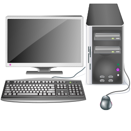
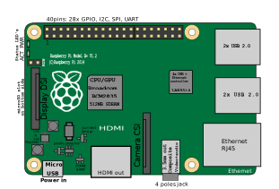
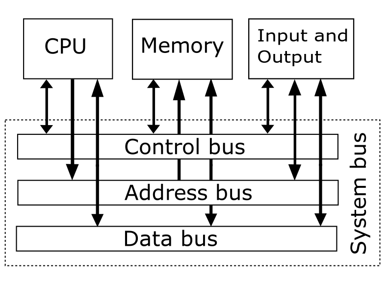
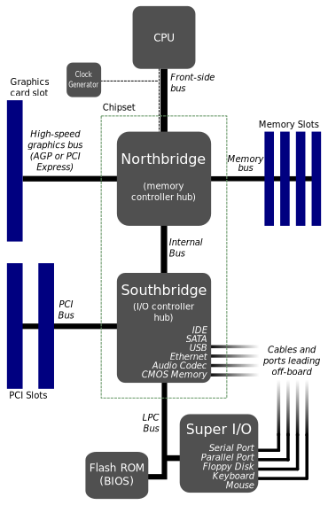

# 第三章 计算机架构

要编写底层代码，程序员必须理解计算机的架构。这就好像要用某个软件框架写程序，那就必须知道这个框架是解决的是哪一类问题，以及如何通过框架提供的接口使用这个框架。但是在讨论计算机架构的定义之前，我们必须理解到底什么是计算机，因为许多人仍然以为计算机就是我们放在桌子上的常规计算机，或者充其量是台服务器。然而计算机可以有各种各样的形状和尺寸，有些设备让人们很难想象它们是计算机，而代码都能运行在这样的设备上。

## 3.1 什么是计算机？

*计算机*是种硬件设备，至少由处理器（CPU）、存储设备以及输入输出接口构成。所有的计算机都可以划分位两组类型：

*单用途计算机*是硬件层面专为某类任务构建的计算机。比如，专用的编码解码器，计时器，图片/视频/音频处理器。

*通用计算机*是可以通过编程（而不去改动硬件）来模拟单用途计算机各种功能的计算机。

### 3.1.1 服务器

*服务器*是一种拥有海量资源的高性能通用计算机，为广大用户提供大型服务。人们把它们的个人计算机连接到服务器，享受服务。

图3.1.1 刀片服务器。每个刀片服务器都是有着模组化设计，为节省物理空间和能耗优化的计算机。刀片服务器的外保护叫做*机柜*。（来源：[Wikimedia](https://commons.wikimedia.org/wiki/File:Wikimedia_Foundation_Servers-8055_35.jpg)，作者：Victorgrigas）

### 3.1.2 桌面计算机

*桌面计算机*是一种通用计算机，搭载专为一般用户设计的输入输出系统，以及满足日常使用的适度资源。输入系统通常包括鼠标键盘，而输出系统通常包括高分辨率显示器。计算机安装在机箱内，足够放下各类计算机组件，例如处理器、主板、电源、硬盘等等。

图3.1.2 经典的桌面计算机

### 3.1.3 可移动计算机

*可移动计算机*与桌面计算机类似，拥有的资源较少但是方便携带。

图3.1.3 可移动计算机

（a）笔记本电脑

（b）平板电脑

（c）移动电话

### 3.1.4 游戏主机

游戏主机与桌面计算机类似，但是为游戏进行了优化。没有了键盘鼠标，游戏主机的输入系统是游戏手柄，是一种通过少量按键来控制屏幕上目标的设备；输出系统则是电视。机箱也与桌面计算机类似，但是更小巧。游戏主机使用的是定制化的处理器和显示芯片，但是依旧与桌面计算机搭载的类似。比如初代的Xbox就使用了一颗定制的英特尔奔腾III处理器。

图3.1.4 现世代的游戏主机

（a）PS4

（b）Xbox One

（c）Wii U

手持掌机与游戏主机类似，但是把输入输出系统与计算机包装在了一起。

（a）任天堂 DS

（b）PS Vita

### 3.1.5 嵌入式计算机

*嵌入式计算机*是资源有限的单板或单芯片计算机，专为集成到更大型的硬件设备中设计的。

图3.1.6 嵌在PC主板上的英特尔82815图形内存控制器。（来源：[Wikimedia](https://commons.wikimedia.org/wiki/File:Intel_82815_GMCH.jpg)，作者：Qurren）

图3.1.7 PIC微控制器

*微控制器*是一种嵌入式计算机，转为控制其它硬件设备设计，直接安装在芯片上。微控制器算是通用计算机，但是因为资源有限，只能执行一项或是几项专门任务。这种计算机虽然用途单一，但是由于它们可以通过编程，根据需求执行不同的任务而无需改动底下的硬件，于是仍然算是通用计算机。

另一种类型的嵌入式计算机是*单片系统*。*单片系统*是在单个芯片上的完整计算机。尽管微控制器也在芯片上，然而它的目的不同：去控制某些硬件。微控制器通常更简单，硬件资源更有限，因为它运行时只会专注于单个用途，而单片系统是通用计算机，可以用于多个用途。单片系统运行起来与桌面计算机一样，可以加载操作系统，运行不同的应用。单片系统常见于智能手机中，比如iPad 2和iPhone 4S中的苹果A5芯片，或是许多安卓手机中的高通骁龙芯片。

图3.1.8 苹果A5芯片

不管是微控制器还是单片系统，必定存在一个环境把这些元器件连接到其它设备。这样的环境是叫做PCB的电路板，即*印制电路板*。*印制电路板*是一张包含电路和焊盘的物理板，使得电流可以在电子元件之间流动。没有PCB，元器件就没有办法组合构成更大的设备。只要这些元器件隐含在更大型的设备中，作为运行在更高一层次的设备的一部分满足更高级的需求，它们就算是嵌入式设备。为这些设备编写程序因此也叫做*嵌入式编程*。嵌入式计算机常用在自动控制设备中，包括电动工具、玩具、可植入式医疗设备、办公设备、引擎控制系统、家用电器、遥控器以及其它各种类型的嵌入式系统。

图3.1.9 树莓派B+ 1.2版，一个既有单片系统也有微控制器的单板计算机。

（a）功能图。单片系统是高通BCM2835。微控制器是以太网控制器LAN9514。（来源：[Wikimedia](https://commons.wikimedia.org/wiki/File:Raspberry_Pi_B%2B_rev_1.2.svg)，作者：Efa2）

（a）实物图。

微控制器与单片系统的划分很模糊。如果硬件不断演进、变得越来越强大，那么微控制器就能获得足够的资源来运行一个微型操作系统用于多个专业用途。而单片系统处理微控制器的任务是游刃有余的。然而，把单片系统当作微控制器使用可不是一个好主意，不但成本会显著上升，而且因为微控制器的软件不需要多少计算机资源，造成了浪费。

### 3.1.6 现场可编程逻辑门阵列

*现场可编程逻辑门阵列（FPGA）*是一种由可配置的门阵列组成、出厂后电路结构可以编程的硬件这就是为什么被叫做现场可编程逻辑门阵列的原因：在应用的现场可以直接修改。回忆一下在上一章，每个74HC00芯片都可以配置为一个门，组合多个74HC00芯片可以构建更复杂的设备。类似的，每个FPGA设备包含了上千个叫做逻辑区块的芯片，每个逻辑区块都是比74HC00更加复杂的芯片，经过配置可以实现布尔逻辑函数。这些逻辑区块可以串起来构建高阶硬件功能。这种高阶功能通常是需要高速处理的专用算法。

图3.1.10 FPGA架构（来源：[国家仪器](https://www.ni.com/tutorial/6097/en/)）

数字元器件可以通过组合逻辑门来设计，而无需关心实际的电路组件，因为这些物理电路只是数个CMOS电路而已。数字硬件，包括各种计算机内的组件，是通过程序员写代码设计的，使用的是一种可以描述门是如何连接在一起的编程语言。这种语言叫做*硬件描述语言*。之后，对硬件的描述被编译成连接起来的电子原件的描述，叫做*网表*，它更详细地描述了门是如何连接起来地的。

FPGA与其它嵌入式计算机的区别在于FPGA里的程序是实现在数字逻辑一层的，而类似微控制器或是单片系统设备这样的嵌入式计算机的程序是实现在汇编代码一层的。为FPGA设备编写的算法是用逻辑门描述的，FPGA设备根据这个描述进行自我配置以执行算法。而为微控制器编写的算法是用汇编指令写的，处理器可以直接理解，然后进行相应操作。

FPGA应用的场景，都是些在一般计算机上执行不太合适且花销巨大的特定操作，例如实时医疗图片处理、巡航控制系统、电路原型设计、视频编解码等等。这些应用都有一般处理器无法实现的高速处理的需求，因为处理器在实现一个特定操作中会浪费大量时间执行非特定指令——加总起来可以达到数千个指令，甚至更多，因而物理层就有更多的电路来执行这些操作。FPGA设备就没有这样的额外开销；相比之下，它直接在硬件中实现了单个特定操作。

### 3.1.7 专用集成电路

*专用集成电路（ASIC）*是一种专为某个需求设计、非通用的芯片。不像FPGA，ASIC没有可以重新配置来适应各种操作的通用逻辑块阵列；相反地，ASIC中每个逻辑块都为电路自身设计优化。FPGA可以理解为ASIC的原型设计阶段，而ASIC则是电路生产的最终阶段。相比于FPGA，ASIC更加定制化，于是可以获得更好的性能。然而，ASIC的生产非常昂贵，一旦电路得到生产而出现了设计错误，整批产品只能作废，而FPGA设备因为只是通用门阵列，只需要重新编程就好了。

## 3.2 计算机架构

上一节我们了解了计算机的不同类别。无论外形还是尺寸，每台计算机都是针对从高层到底层的体系结构而设计的。

> 计算机架构 = 指令集架构 + 计算机组成 + 硬件

位于最高层的是指令集架构。

位于中层的是计算机组成。

位于最底层的是硬件

### 3.2.1 指令集架构

*指令集*是微处理器可以理解并执行的基本命令指令集。

*指令集架构*，或*ISA*，是实现了指令集的环境的设计。本质上它是一个运行时环境，就像是高级编程语言的解释器一样。这个设计包括了所有的指令、寄存器、终端、内存模型（将被应用使用的内存是如何分布的）、地址模式、输入/输出等等。一个CPU的功能越多（比如，指令更多），实现所需的电路就更多。

### 3.2.2 计算机组成

*计算机组成*是功能角度的计算机设计。从这个角度出发，计算机的硬件用有输入输出的方框表示，连接彼此，组成一台计算机的设计。两台计算机也许有同样的指令集架构，但是有着不同的组成。举个例子，AMD与英特尔处理器都实现了x86指令集，但是组成指令集环境的各个处理器的硬件组件是不同的。

计算机组成非常依赖厂商的设计，但是它们都源自冯·诺伊曼约翰·冯·诺伊曼是一位数学家和物理学家，他发明了计算机架构架构。

图3.2.1 冯·诺伊曼架构

*CPU*从主内存持续获取指令并执行。

*内存*储存应用程序代码及数据。

*总线*是用来在上述组件之间发送原始位（bit）数据的电线。

*I/O设备*是为计算机获取输入的设备，比如键盘、鼠标、传感器。。以及从计算机获取输出的设备，比如显示器把从CPU发出的信息显示出来，根据CPU计算出的模式打开关闭LED。。。

冯·诺伊曼架构的计算机按照如下方式运行：所有指令储存在主存储中，CPU重复性地把这些指令传入自己的内部存储用于顺序执行。数据通过总线在CPU、内存以及输入输出设备之间传递，而在设备中的什么地方存储它们则是CPU通过地址总线进行传输。这个架构完备地实现了*获取——解码——执行*的循环。

早期的计算机精确地实现了冯·诺伊曼架构，CPU、内存与输出输出设备通过同一个总线通信。今天，计算机有多条总线，每一种专为一种通信服务。然而它们本质上仍然是冯·诺伊曼架构。为了给冯·诺伊曼架构的计算机编写操作系统，程序员需要能够了解并编写代码来控制核心组件：CPU、内存、输入输出设备以及总线。

*CPU*，或是*中央处理器*，是任何计算机系统的核心与大脑。理解CPU对于从头开始编写操作系统必不可少：

- 要使用这些设备，成需要需要控制CPU来使用其它设备的可编程接口。CPU是唯一的途径，因为CPU是程序员唯一可以直接使用的设备，也是唯一可以理解程序员代码的设备。
- 在CPU里，许多操作系统的概念硬件已经直接实现了，比如任务切换，分页。内核程序员需要知道如何使用这些硬件功能，从而避免在软件中重复实现这些概念，导致资源的浪费。
- CPU内建的操作系统功能既提升了操作系统性能又提升了开发者效率，因为这些功能都是硬件层次的，已经是最底层了，开发者可以自由使用这些功能。
- 为了更有效率地使用CPU，程序员需要理解CPU厂商提供的文档。比如说，[英特尔® 64 位和IA-32 架构开发人员手册](https://software.intel.com/content/www/us/en/develop/articles/intel-sdm.html)
- 在足够了解一种CPU架构之后，理解其它CPU架构也会更容易。

CPU是指令集架构的一种实现，也就是一种汇编语言的实现（CPU架构不同，语言也会不同）。汇编语言是提供给软件工程师控制CPU、进而控制计算机的众多接口之一。但是是如何做到只访问CPU就可以控制每一台计算机的？简单地说，CPU可以通过以下两个接口与其它设备通信，进而向它们发号施令。

*寄存器*是用于高速数据访问，并与其它硬件设备通信的组件。通过写入设备寄存器，或是读取设备寄存器获取硬件设备信息，软件可以直接控制硬件。

然而不是所有寄存器都是用来与其它设备通信的。在CPU里，大多数寄存器被用作临时数据的高速缓存。CPU可以通信的其它设备始终有一组寄存器是用来与CPU交互的。

*端口*是硬件设备中一个专门的寄存器，用来与其它设备通信。当输入写入一个端口，它导致硬件设备根据写入的值执行某些操作。端口与寄存器的区别在于端口不存储信息，而是把它们代理给其它某些电路。

这两个接口极其重要，因为它们是软件控制硬件唯二的接口。编写设备驱动本质上是学习各个寄存器的功能，以及如何恰当地使用它们来控制设备。

内存是用来储存信息的存储设备。它由许多单元组成。每个单元都是一个有着独立地址的字节，于是CPU可以利用这样的地址来访问内存中一个确切的位置。内存是软件指令（以机器语言的形式）存储，以及CPU获取将要执行指令的地方；内存也是储存某些软件所需数据的地方。内存在冯·诺伊曼架构内不区分哪些字节是数据，哪些是软件指令。这是由软件来决定的，如果因为某些未知的原因，数据被当作指令获取并执行了，CPU会把这些数据当作合法的指令仍然执行它们，但是可能因此产生未知的效果。对于CPU来说，没有代码与数据之分；二者只是不同类型的数据而已：一种告诉CPU以何种方式做某件事情，而另一种则是执行这种操作所必须的材料。

随机存取存储器（RAM）是由*内存控制器*控制的。今天，绝大部分处理器都内嵌了这个设备，于是CPU有了一条专用内存总线连接处理器与RAM。然而在旧的CPU上，这个设备位于北桥芯片内。在这个场景里，CPU并不直接与RAM通信，而是与北桥芯片通信，而后这颗芯片再读取写入内存。相比之下，第一种方案因为CPU与内存之间的通信没有中间人角色，因而有着更好的性能。

图3.2.2 CPU-内存之间的通信

（a）旧的CPU

（a）新的CPU

在物理层面，RAM是由单元晶格实现的，每个单元包含一个晶体管和一个叫做电容器的设备，它可以在一小段时间内储存电荷。晶体管控制着对电容器的访问；当开关打开，它允许从电容器读取或写入少量电荷。由于电容器上的电荷会缓慢耗散，于是需要包含刷新电路，从而周期性地从单元内读出值，然后由外部电源的放大以后再写回去。

总线是在计算机组件之间或计算机之间传输数据的子系统。物理层面上，总线就是把所有组件连接在一起的电路，而每条电路都会传输大量数据。而电路的总数被叫做*总线带宽*，且依赖于CPU可以支持的电路条数。如果CPU只能一次接受16位，那么连接组件到CPU的总线就有16条电路，意味着CPU一次只能接收16位的数据。

### 3.2.3 硬件

硬件是计算机的一种特定实现。一产品线的处理器实现了相同的指令集架构、使用了几乎一摸一样的组成，然而在硬件实现上却有所区别。比如说，Core i7系列提供了为桌面计算机使用的型号，功能更强大，能耗也更高，而为笔记本提供的型号性能稍差，然而能效更高。为硬件设备编写软件，如果有文档可以查阅我们很少需要了解具体硬件实现。计算机组成，尤其是指令集架构对于操作系统程序员来说会更相关一些。也正是这个原因，下一章我们会专门来深入学习x86指令集架构。

## 3.3 x86架构

*芯片组*是有着多种功能的芯片。历史上，芯片组实际上是指一组独立的芯片，其中每一个都具体负责某个功能，比如内存控制器、显卡控制器、网络控制器、电源控制器等等。随着硬件的发展，这一组芯片合并成了单个芯片，因而空间、能耗以及成本收益都更高。在桌面计算机里，各种硬件设备通过*主板*这张PCB相互连接起来。而CPU需要兼容的主板承载它。每个主板都是由芯片组模型定义的，而这个模型决定了CPU可以控制的环境。通常，这个环境的组成包括：

- 一个或多个CPU插槽
- 由北桥和南桥两个芯片组成的芯片组
  - 北桥芯片负责CPU、主内存以及显卡之间的高速通信
  - 南桥芯片负责与输入输出设备以及其它对性能不敏感的设备的通信。
- 内存条插槽
- 一个或多个显卡插槽
- 为其它设备使用的通用插槽，比如网卡、声卡
- 输入输出设备的端口，比如键盘、鼠标、USB

图3.3.1 主板组成

要写一个完整的操作系统，成需要需要理解如何对这些设备编程。毕竟，操作系统应该自动管理硬件，从而避免每个应用程序也要这么做。然而，对于所有组件来说，学习对CPU编程是最重要的，因为它出现在任意一台计算机内，无论是那种类型的计算机。也就是这个原因，本书主要关注于如何对x86 CPU编程。即使是只关注这一种设备，也可以写出一个相当不错的最小操作系统。背后的原因在于不是所有的计算机都像普通的桌面计算机一样包含了所有的设备。比如说，嵌入式计算机很可能只有CPU，相当有限的内存，以及获取输入、产生输出的针脚；然而，为这样的设备也已经有了很多操作系统。

然而，学习如何为x86 CPU编程是项艰巨的任务，为它编写的主要手册已经有了三本：第一卷大概有500页，第二卷超过2000页，第三卷超过1000页。对于一个程序员来说，掌握x86 CPU编程的各个方面会是一个令人印象深刻的壮举。

## 3.4 英特尔Q35芯片组

Q35是2007年九月发布的英特尔芯片组。Q35被用作一个高级计算机组成的范例是因为稍后我们将使用QEMU来模拟一个Q35系统，这是QEMU可以模拟的最新的英特尔系统。虽然发布于2007年，Q35对于今天的硬件来说也是相当现代的，它的相关知识可以直接在如今的芯片组模型上复用。有了Q35芯片组，模拟出来的CPU也具有相对较新，有着当今CPU所具有的各种功能，因而我们可以使用最新的英特尔软件手册。

图3.3.1是当下经典的主板组成图，而Q35有着类似的组成。

## 3.5 x86执行环境

*执行环境*是提供了使代码可以执行的相关设施的环境。它需要解决下面几个问题：

- 支持的操作？ 输出传输、算术计算、控制、浮点。。。
- 运算子在哪里储存？ 寄存器、内存、栈、累加器
- 对于每个指令显式运算子分别有几个？0、1、2或是3
- 运算子位置是如何指定的？寄存器，立即，间接。。。
- 支持什么类型与大小的运算子？字节、整型数、单精度浮点数、双精度浮点数、字符串、向量。。。
- 等等等等

所以本章的其余部分，就是继续读英特尔手册第1卷到第3章，“基本执行环境”。
