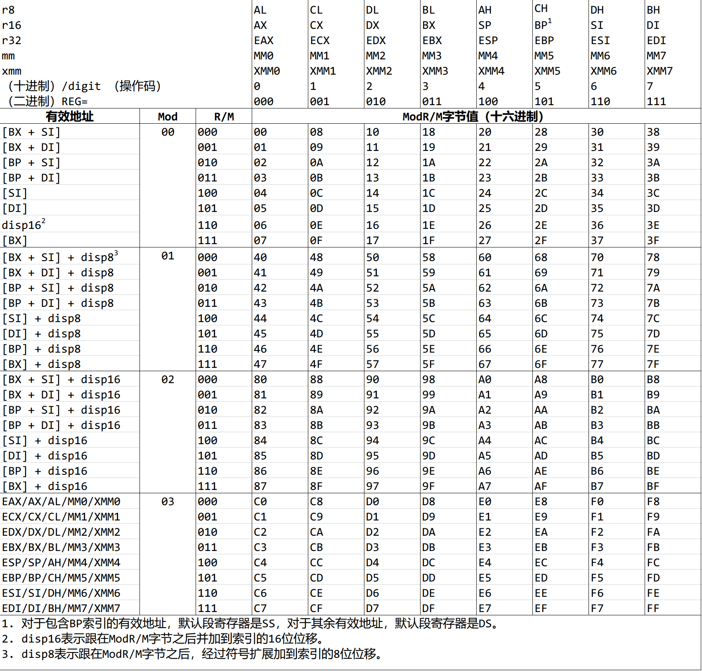
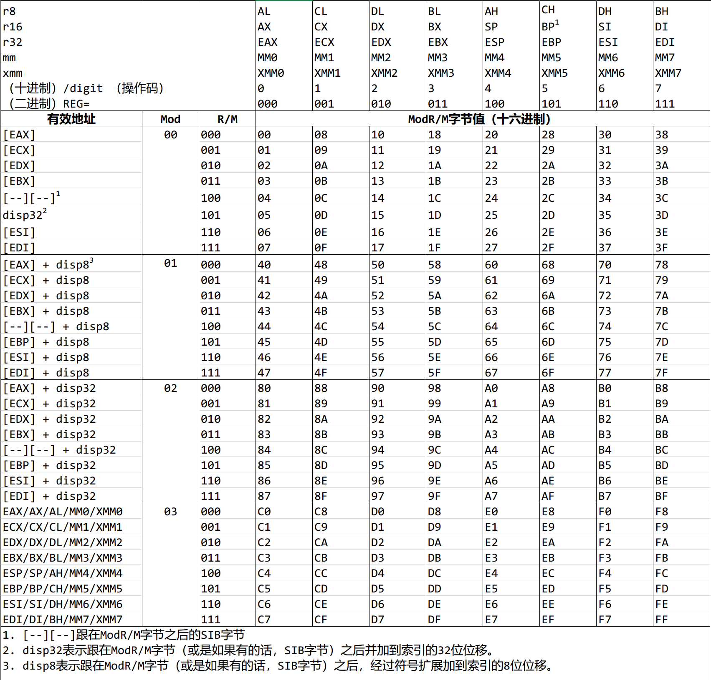
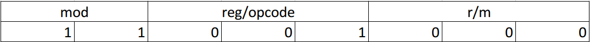
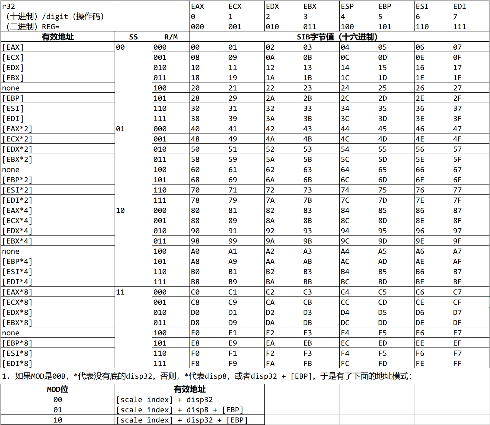
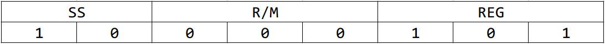
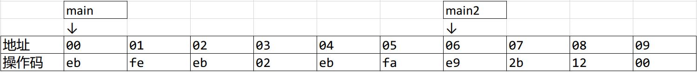
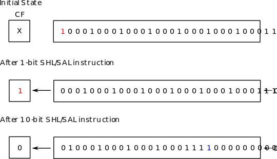
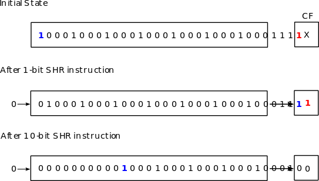

# 第四章 x86汇编与C

这一章，我们将会了解汇编语言，以及它是如何与C连接起来的。但是我们为什么要这么做呢？难道不应该信任编译器吗？现在没人还写汇编代码了吧？

并不是这样的。当然，眼下的编译器都是值得信赖的，绝大部分时间我们也不需要用汇编写代码了。编译器可以生成代码，但是如先前提到过的，高阶语言是低阶语言模式的集合。它没有涵盖硬件平台提供的所有内容。因此，不是所有的汇编指令编译器都可以生成，于是我们仍然需要为这些场景编写汇编代码来访问硬件特定功能。既然硬件特定功能需要编写汇编代码，调试时就需要读它们。相比于编写，也许我们会花更多的时间阅读代码。使用与硬件直接交互的底层代码，汇编时绕不开的。同时，理解编译器如何生成汇编代码可以提升程序员的效率。比如说，如果一份工作或是学校作业要我们写汇编代码，我们只需要写C代码，然后让gcc去做那些脏活累活——为我们生成汇编代码。我们只需要整理生成的汇编代码，如果有必要稍微修改一番，然后任务就完成了。

我们将着重学习objdump，以及如何使用英特尔的文档帮助我们理解x86汇编代码。

## 4.1 `objdump`

*objdump*是一个可以显示目标文件（object files）信息的程序。稍后在调试手动链接过程中产生的不正确的布局时会很有用。现在，我们用`objdump`来检查高阶源代码是如何映射到汇编代码的。我们暂时忽略输出，首先了解如何使用这个命令。使用`objdump`是很简单的：

```bash
$ objdump -d hello
```

`-d`选项只会显示可执行节的汇编内容。节是一块包含程序代码或是数据的内存。代码节可以被CPU执行，而数据节无法被执行。非可执行节，比如`.data`和`.bss`（用来存储程序数据）、调试节等等是不会显示出来的。在第五章学习可执行与可链接格式的二进制文件格式时会了解更多关于节的知识。另一方面：

```bash
$ objdump -D hello
```

这里的`-D`选项会显示所有节的汇编内容。如果启用了`-D`，`-d`也就隐式的启用了。`objdump`最常用于检查汇编代码，所以`-d`选项最有用，并因此默认是启用的。

程序的输出太多，会超出终端屏幕的显示范围。为了方便阅读，可以把所有输出发送到`less`：

```bash
$ objdump -d hello | less
```

想要把源代码与汇编混在一起方便学习，就必须用`-g`选项编译二进制文件，把源代码包含其中，然后加上`-S`选项

```bash
$ objdump -S hello | less
```

`objdump`使用的默认语法是AT&T语法。想要换成熟悉的英特尔语法：

```bash
$ objdump -M intel -D hello | less
```

使用`-M`选项时，必须显式地指明`-D`或是`-d`选项。之后，我们会使用`objdump`来检查编译后的C数据和代码用机器代码是如何表示的。

最终，我们会写一个32位的内核，因此我们需要编译一个32位的二进制文件，并且在32位模式下检查它：

```bash
$ objdump -M i386,intel -D hello | less
```

`-M i386`告诉`objdump`用32位布局显示汇编内容。理解32位与64位的差异对于编写内核代码至关重要。我们会在稍后编写我们自己的内核时检查这个问题。

## 4.2 读取输出

输出首先显示的是对象文件的文件格式信息：

```bash
hello: file format elf64-x86-64
```

之后是一系列的反汇编节：

```
Disassembly of section .interp:
...
Disassembly of section .note.ABI-tag:
...
Disassembly of section .note.gnu.build-id:
...
...
```

等等。

最后，每一反汇编节会显示它的实际内容：按下列格式排列的一系列汇编指令。

```assembly
4004d6:       55                      push   rbp
```

* 第一列是汇编指令的地址。在上边的例子里，这个地址是`0x4004d6`。
* 第二列是以原始十六进制值表示的汇编指令。在上边的例子里，这个值是`0x4004d6`。
* 第三列是这条汇编指令。根据当前的节信息，这条汇编指令可能有意义，也可能没有意义。举个例子，如果这条汇编指令在`.text`节，那么这些汇编指令就是实际的程序代码。而如果这些汇编指令在`.data`节，我们就可以放心地忽略这些指令。背后的原因是`objdump`不知道哪些十六进制值是代码，哪些是数据，于是不加区分地把每一个十六进制值都翻译成了汇编指令。在上边地例子里，这个汇编指令是`push %rbp`。
* 可选的第四列是注释，告知地址的来源。注释只有在有引用指向这个地址时才会出现。比如说，下边蓝色的注释：
  
  ```assembly
  lea   r12, [rip + 0x2008ee]   #600e10 <__frame_dummy_init_array_entry>
  ```

  就是用来告知从`[rip + 0x2008ee]`指向的地址是`0x600e10`，保存着`__frame_dummy_init_array_entry`变量。

在反编译节中也会包含*标签*。标签是一条汇编指令人为加上的名字。为了方便人们理解，这个标签标记了一个汇编代码块的目的。比如说，`.text`节包含了许多这样的便签，标记了程序代码从哪里开始；下面的`.text`节包含了两个函数：`_start`和`deregister_tm_clones`。`_start`函数从地址`4003e0`开始，这个值被标记在函数名的左边。`_start`标签正下方的指令也位于地址`4003e0`。整体来看，这意味着标签只是内存地址的一个名字。函数`deregister_tm_clones`也有着同样的格式，就好像这一节里其它的函数一样。

```assembly
00000000004003e0 <_start>:
  4003e0:       31 ed                   xor    ebp,ebp
  4003e2:       49 89 d1                mov    r9,rdx
  4003e5:       5e                      pop    rsi
...more assembly code....
0000000000400410 <deregister_tm_clones>:
  400410:       b8 3f 10 60 00          mov    eax,0x60103f
  400415:       55                      push   rbp
  400416:       48 2d 38 10 60 00       sub    rax,0x601038
...more assembly code....
```

## 4.3 英特尔手册

恰当地理解、使用汇编语言的最佳方式就是准确地理解底层计算机架构以及每一条机器指令。要做到这一点，最可靠的信息来源就是厂商提供的文档。毕竟，是硬件厂商生产了这些硬件设备。要理解英特尔的指令集，我们需要文档《英特尔® 64 位和IA-32 架构开发人员手册2A、2B、2C和2D合订本：指令集参考，A到Z》。文档可以在这里获取：<https://software.intel.com/content/www/us/en/develop/download/intel-64-and-ia-32-architectures-sdm-combined-volumes-2a-2b-2c-and-2d-instruction-set-reference-a-z.html>

* 第一章提供了手册的简要信息，以及书中使用的注释标记法。
* 第二章详细介绍了汇编指令的结构，我们会在下一节对它进行研究。
* 第三章到第五章介绍了x86_64架构每一条指令的细节。
* 第六章详细介绍了更安全模式扩展。这一章我们不需要用它。

《英特尔® 64 位和IA-32 架构开发人员手册第一卷：基础架构》介绍了英特尔处理器的基础架构以及编程环境。本书的第五章总结出了所有英特尔指令，并按不同的类别进行了排列。为了我们自己的操作系统，我们只需要了解列在*章节5.1*的通用指令。*第七章*会描述每个类别的目的。逐步地，我们会学习所有这些指令。

习题 4.3.1 阅读第二卷章节1.3，忽略章节1.3.5和1.3.7。

## 4.4 体验汇编代码

接下来的章节会检查汇编指令的组成。为了充分理解它，就有必要写一些代码，然后看看它们以十六进制数字显示的实际形式。为了这个目标，我们用`nasm`汇编器来写几行汇编代码，看看生成的代码是什么样的。

---

示例 4.4.1 假设我们想要看看下面这条指令生成的机器码：

```assembly
jmp eax
```

那么，我们用编辑器，比如Emacs，构建一个新文件，写下这行代码然后保存到文件，比如`test.asm`。然后，在终端执行下面的命令：

```bash
$ nasm -f bin test.asm -o test
```

`-f`选项声明了最终输出文件的文件格式，比如ELF。但是在这个例子中，格式是`bin`，意思是这个文件只是一个普通的二进制输出，没有任何额外的信息。也就是说，写出的汇编代码原汁原味的翻译成了机器代码，没有包括类似ELF文件格式一样的额外的元数据。实际上，编译之后我们可以用下面这个命令检查这个输出：

```bash
$ hd test
```
  
`hd`（hexdump的缩写）是以十六进制格式显示文件内容的程序。（虽然它的名字是hexdump的缩写，然而`hd`可以以其它不同的底显示内容，比如二进制）。于是得到了下面的输出：

```bash
  00000000  66 ff e0                          |f..|
  00000003
```

文件只包含了三个字节：`66 ff e0`，它等价于指令`jmp eax`

---

示例 4.4.2 如果我们使用ELF作为文件格式：

```bash
$ nasm -f elf test.asm -o test
```

那么在有许多干扰信息的情况下学习并理解汇编指令就变得更难了：

```bash
00000000  7f 45 4c 46 01 01 01 00  00 00 00 00 00 00 00 00  |.ELF............|
00000010  01 00 03 00 01 00 00 00  00 00 00 00 00 00 00 00  |................|
00000020  40 00 00 00 00 00 00 00  34 00 00 00 00 00 28 00  .......4.....(.|
00000030  05 00 02 00 00 00 00 00  00 00 00 00 00 00 00 00  |................|
00000040  00 00 00 00 00 00 00 00  00 00 00 00 00 00 00 00  |................|
*
00000060  00 00 00 00 00 00 00 00  01 00 00 00 01 00 00 00  |................|
00000070  06 00 00 00 00 00 00 00  10 01 00 00 02 00 00 00  |................|
00000080  00 00 00 00 00 00 00 00  10 00 00 00 00 00 00 00  |................|
00000090  07 00 00 00 03 00 00 00  00 00 00 00 00 00 00 00  |................|
000000a0  20 01 00 00 21 00 00 00  00 00 00 00 00 00 00 00  | ...!...........|
000000b0  01 00 00 00 00 00 00 00  11 00 00 00 02 00 00 00  |................|
000000c0  00 00 00 00 00 00 00 00  50 01 00 00 30 00 00 00  |........P...0...|
000000d0  04 00 00 00 03 00 00 00  04 00 00 00 10 00 00 00  |................|
000000e0  19 00 00 00 03 00 00 00  00 00 00 00 00 00 00 00  |................|
000000f0  80 01 00 00 0d 00 00 00  00 00 00 00 00 00 00 00  |................|
00000100  01 00 00 00 00 00 00 00  00 00 00 00 00 00 00 00  |................|
00000110  ff e0 00 00 00 00 00 00  00 00 00 00 00 00 00 00  |................|
00000120  00 2e 74 65 78 74 00 2e  73 68 73 74 72 74 61 62  |..text..shstrtab|
00000130  00 2e 73 79 6d 74 61 62  00 2e 73 74 72 74 61 62  |..symtab..strtab|
00000140  00 00 00 00 00 00 00 00  00 00 00 00 00 00 00 00  |................|
*
00000160  01 00 00 00 00 00 00 00  00 00 00 00 04 00 f1 ff  |................|
00000170  00 00 00 00 00 00 00 00  00 00 00 00 03 00 01 00  |................|
00000180  00 74 65 73 74 2e 61 73  6d 00 00 00 00 00 00 00  |.disp8-5.asm....|
00000190
```

因此，在这种情况下就使用普通二进制格式，指令逐条进行实验效果会更好。

有了这样简单的工作流，我们就做好了研究每一条汇编指令结构的准备。

注意：使用`bin`模式会把`nasm`默认置为16位模式。要启用生成32位代码的功能，我们必须在`nasm`源代码文件头加上下面一行：

```assembly
bits 32
```

## 4.5 剖析汇编指令

指令参考手册第二章深入介绍了指令的格式。然而对于初学者来说，信息量太大了。所以这一节我提供了一个简版的指导，方便您阅读手册。


还记得一条汇编指令就是固定长度的比特序列（series of bit）吗？指令之间长度各不相同，取决于指令本身的复杂程度。每一条指令的共通之处是上图中描述的通用格式，指令比特序列被划分成了更小的几部分，各自包含了不同类型的信息。包括：

*指令前缀*出现在指令头部，是可选项。实际上，前缀只是另外一个汇编指令，插入在可以被应用的汇编指令之前，程序员可以灵活选择使用。有着２或３字节操作码的指令默认包含前缀。

*操作码*是标示指令的唯一数值。每个操作码都有一个易于理解的标识符，比如指令`add`的操作码之一是`04`。当CPU在指令缓存中看到数字`04`，它识别出指令`add`并相应地执行。操作码可以有１到３字节长，如有需要还会包含一个额外的在`ModR/M`字节的３位长字段。

示例 4.5.1 指令：

```assembly
jmp [0x1234]
```

生成下面的机器码：

```text
ff 26 34 12
```

第一个字节，`0xff`是操作码，`jmp`指令独有。

*ModR/M*包含了指令的操作数。操作数可以是寄存器、内存地址或者就是值本身。指令的这一部分由３小部分组成：

* *mod*字段，也叫做*修饰符*字段，与`r/m`字段组合起来可以包含共计５位长的信息，从而可以编码32个可能的值：8个寄存器以及24种寻址模式。
* *reg/opcode*字段要么包含一个寄存器操作数，要么扩展额外３位的操作码字段。
* *r/m*字段要么包含一个寄存器操作数，要么与`mod`字段结合从而包含一种寻址模式

表4.5.1与表4.5.2列出了`ModR/M`字节所有256个值，以及每个值是如何映射到16位和32位的寻址模式与寄存器的。





如何阅读这些表格：

在指令种，紧挨着操作码的是`ModR/M`字节。然后，在表中查找字节字节值从而在对应的行与列获取操作数。

---

示例 4.5.2 一条指令使用下列寻址模式：

```assembly
jmp [0x1234]
```

然后生成的机器码是：

```text
ff 26 34 12
```

`0xff`是操作码。紧挨着的`0x26`是`ModR/M`字节。在16位表中查找（还记得吗？使用`bin`格式默认生成16位代码），第一个操作数在行，等于`disp16`，意思是一个16位偏移量。因为这个指令没有第二个操作数，那么列可以被忽略。

示例 4.5.3 一条指令使用下列寻址模式：

```assembly
add eax, ecx
```

然后生成的机器码是：

```text
01 c8
```

`0x01`是操作码。紧挨着的`c8`是`ModR/M`字节。在16位表中查找值`c8`，行告诉我们第一个操作数是`ax`（还记得吗？使用`bin`格式默认生成16位代码），列告诉我们第二个操作数是`cx`; 这里列不能被忽略，因为指令里存在第二个操作数。

为什么第一个操作数在行，第二个操作数在列？我们用值`c8`做例子，把`ModR/M`字节拆解成位：



`mod`字段把寻址模式划分成了４种不同的类别。配合`r/m`字段，可以从24列中准确选出一种寻址模式。如果指令只需要一个操作数，那么列可以被忽略。最终，如果指令需要，`reg/opcode`字段会提供一个额外的寄存器或是不同的变体（an extra register or different variants）。

---

*SIB*是Scale-Index-Base字节。这个字节包含了计算内存地址到数组元素的方式。SIB这个名字来源于下面这个计算有效地址的公式：

```text
实际地址 = scale ∗ index + base
```

* `Index`指的是数组内的偏移量
* `Scale`是`Index`的倍数。必须是1、2、4、8中的一个值；其它值都是非法的。要放大2、4、8以外的值，`Scale`必须设为1，然后手动计算偏移量值。举个例子，如果我们想要获得数组内第n个元素的地址，且每个元素的大小为12个字节。因为大小不是1、2、4、8，所以`Scale`被设为1，而后编译器需要计算偏移量：

  ```text
  实际地址 = 1 ∗ (12 ∗ n) + base
  ```

  我们可以手动计算偏移量，可为什么还用到了`SIB`呢？原因在于上边的场景里，获取便宜量需要执行额外一个`mul`指令，而`mul`指令本身会消耗至少１个字节，而SIB只占据１个字节。更重要的是，如果这个元素在循环中重复访问多次，比如上百万次，那么这个额外的`mul`指令会因为CPU花费时间执行这额外上百万次`mul`指令而导致性能下降。

  值2、4、8不是随便选的。它们对应16位（２个字节），32位（４个字节）以及64位（8个字节）数，都常见于密集型数字运算。
* `Scale`是起始位置。

下表列出了所有256个`SIB`字节可能的值，它的查找规则与`ModR/M`表类似：



示例 4.5.4 下面的指令：

```assembly
jmp [eax*2 + ebx]
```

生成下边的代码：

```text
00000000  67 ff 24 43
```

首先，首字节`0x67`不是操作符，而是前缀。这个数字是一种预定义前缀，用来重写地址大小。在这之后，是操作码`0xff`以及`ModR/M`字节`0x24`。`ModR/M`的值表示在它之后存在一个`SIB`字节，值是`0x43`。

查找`SIB`表，行告诉我们`eax`放大倍数为2，而列告诉我们基数存在`ebx`中。

*位移*是相对于起始索引位置的偏移量。

示例 4.5.5 下面的指令：

```assembly
jmp [0x1234]
```

生成下边的代码：

```text
ff 26 34 12
```

`0x1234`，生成的原始机器码为`34 12`，就是位移，紧跟在`0x26`，`ModR/M`字节之后。

示例 4.5.6 下面的指令：

```assembly
jmp [eax * 4  + 0x1234]
```

生成下边的代码：

```text
67 ff 24 8d 34 12 00 00
```

* `0x67`是地址尺寸重写前缀。它的涵义是如果一条指令运行的默认地址大小比如说是16位，使用这个前缀就可以使这条指令使用非默认的地址尺寸，比如32位或者64位。由于二进制默认应该是16位的，`0x67`把指令变成了32位模式。
* `0xff`是操作码。
* `0x24`是`ModR/M`字节。根据表格4.5.2，这里的值表明在它之后有一个`SIB`字节。
* `0x85`是`SIB`字节。根据表格4.5.3，字节`0x85`可以被拆解为以下的比特序列：

  

  上边的值是从列`SS`、`R/M`以及共有8列的`REG`列中分别获取的。这些位组合起来得到了值`10000101`，也就是16进制的`0x85`。默认情况，如果位移之后的寄存器没有指明，那么就会被赋值到`EBP`寄存器，并因此总会选中第六列（位模式`101`）。如果示例使用的是另外一个寄存器：

  示例 4.5.7 比如说：

  ```assembly
  jmp [eax * 4 + eax + esi]
  ```

  `SIB`字节变成了`0x86`，也就是第七列。试着用表4.5.3再确认一次。
* `34 12 00 00`是位移。可以看到，它的尺寸有４个字节，也就是32位，拜地址尺寸重写前缀所赐。

*即时值* 当指令可以接收一个固定值，比如`0x1234`作为操作数，这个可选字段保存着这个值。请注意这个字段与位移是不同的：它不见得一定被用作偏移量，而可以是任意用途的任何值。

示例 4.5.8 下面的指令：

```assembly
mov eax, 0x1234
```

生成下边的代码：

```text
66 b8 34 12 00 00
```

* `0x66`是操作数尺寸重写前缀。与地址尺寸重写前缀类似，这个前缀可以让操作数尺寸使用非默认值。
* `0xb8`是`mov`指令的操作码之一。
* `0x1234`是即将存储在寄存器`eax`中的值。它只表示即将被存入寄存器的值，仅此而已。然而，位移值是用来参与某些地址计算的偏移量。

习题 4.5.1 阅读手册第二卷的章节2.1，获取更多细节。
习题 4.5.2 浏览第一卷的章节5.1。阅读第一卷的第7章。如果有不理解的术语，比如分段，不要担心，因为这些术语将在后面的章节中解释，或着可以被忽略。

## 4.6 深入理解指令

在指令参考手册（第二卷）的第三卷开始，每一条x86指令都有详细的文档记录。每当需要指令的准确行为，我们都可以先查看文档。然而在使用文档之前，首先我们必须了解文档编写的约定。每条指令在组织信息的时候都遵从下面的一般格式：

*操作码表*列出了一条汇编指令所有可能的操作码。

  每张表都包括下列字段，这样的行可以一行或者多行：

  | 操作码 | 指令 | Op/En | 64/32位模式 | CPUID 功能标志 | 描述 |
  |-------|------|-------|-------------|---------------|------|

  *操作码*是分配给一条指令的独一无二的十六进制数。每条指令可以有多个操作码，每个码都表示指令的某种变体。比如说，一种变体要求有一个操作数，但是另一种要求两个。在这一列，除了十六进制数之外还有别的标记。比如说`/r`表示指令的`ModR/M`字节包含一个`reg`操作数以及一个`r/m`操作数。更详细的列表在英特尔手册第二卷的章节3.1.1.1和3.1.1.2。

  *指令*给出的是程序员写代码时可以使用的汇编指令标记。除了好记的操作符标记，比如`jmp`以外，其他标记代表指令中具有特定属性的操作数。比如说，`rel8`表示从指令结束前128字节到指令结束后127字节的相对地址；类似地，`rel16`/`rel32`也表示相对地址，但是操作数大小是16/32位，而不是`rel8`的8位。更详细的列表在英特尔手册第二卷的章节3.1.1.3。

  *Op/En*是操作数（Operand）/编码（Encoding）的缩写。操作数编码指的是`ModR/M`字节如何编码指令所需的操作数。如果指令的变体需要操作数，那么就有额外的一张叫做“指令操作数编码”的表来解释操作数编码，结构如下：

  | Op/En | 操作数１ | 操作数２ | 操作数３ | 操作数４ |
  |-------|---------|---------|----------|---------|

  绝大多数指令都有一到两个操作数。我们会把这些指令用于我们的操作系统，而选择忽略需要三个或者四个操作数的指令。操作数可读、可写，或者二者都支持。标记`(r)`表示可读，而`(w)`表示可写。举个例子，当`操作数１`包含`ModRM:r/m (r)`，它表示第一个操作数被编码在`ModR/M`字节的`r/m`字段，且为只读。

  *64/32位模式*表示操作码列是否支持64位模式以及可能的32位模式。

  *CPUID功能标志*指出必须具备特定的CPU功能才能使用指令。如果CPU不支持必须的功能，那么指令就是非法的。（在Linux中，命令`cat /proc/cpuinfo`列出了可用的CPU，并且在`flag`字段列出了它的功能。）

  *Compat/Leg模式* 许多指令没有*64/32位模式*字段，但是被替换为`Compat/Leg模式`，是*兼容/老旧模式*的缩写。这个模式使得64位的指令变体可以正常运行在16位或者32位模式。

  表 4.6.1 *Compat/Leg模式*里的标记

  | 标记  | 描述                                                |
  |:------|:---------------------------------------------------|
  | Valid | 支持。                                              |
  | I     | 不支持。                                            |
  | N.E.  | 64位的操作码由于与已有的32位操作码重叠的缘故，无法编码。|

  *描述*简要地解释了当前一行的指令变体。

*描述*阐释了指令的目的，并详细解释了指令是如何工作的。

*操作*实现指令的伪代码。如果描述显得含糊不清，这一节是理解一条汇编指令的第二最佳来源。

*影响的标志*列出了对EFLAGS寄存器内系统标志可能造成的影响。

*异常*列出了指令无法正确执行时可能发生的错误。这一节对于操作系统调试来说极有价值。异常可以被划分为以下几类：

* 保护模式异常
* 实地址模式异常
* 虚拟8086模式异常
* 浮点异常
* SIMD浮点异常
* 兼容模式异常
* 64位模式异常

对于我们的操作系统，我们指挥用到保护模式异常和实地址模式异常。它们的详细信息在手册第二卷的章节3.1.1.13和3.1.1.14。

## 4.7 范例：`jmp`指令

让我们来看看老朋友，`jmp`指令。首先是操作码表：

| 操作码         | 指令         | Op/En | 64/32位模式 | CPUID 功能标志  | 描述                                                                                          |
|---------------|--------------|-------|-------------|----------------|-----------------------------------------------------------------------------------------------|
| EB cb         | JMP rel8     | D     | Valid       | Valid          | 短程转移，RIP = RIP + 8位位移，符号扩展至64位。                                                  |
| E9 cw         | JMP rel16    | D     | N.S.        | Valid          | 近程相对转移，位移相对于下一条指令。在64位模式下不支持。                                           |
| E9 cd         | JMP rel32    | D     | Valid       | Valid          | 近程相对转移，RIP = RIP + 32位位移，符号扩展至64位。                                             |
| FF /4         | JMP r/m16    | M     | N.S.        | Valid          | 近程绝对间接转移, 地址 = 0扩展r/m16。在64位模式下不支持。                                         |
| FF /4         | JMP r/m32    | M     | N.S.        | Valid          | 近程绝对间接转移, 地址在给定的r/m32内。在64位模式下不支持。                                       |
| FF /4         | JMP r/m64    | M     | Valid       | N.E.           | 近程绝对间接转移, RIP = 来自寄存器或是内存的64位偏移量。                                          |
| EA cd         | JMP ptr16:16 | D     | Inv.        | Valid          | 远程绝对转移，地址来自操作数。                                                                  |
| EA cp         | JMP ptr16:32 | D     | Inv.        | Valid          | 远程绝对转移，地址来自操作数。                                                                  |
| FF /5         | JMP m16:16   | D     | Valid       | Valid          | 远程绝对间接转移，地址来自m16:16。                                                              |
| FF /5         | JMP m16:32   | D     | Valid       | Valid          | 远程绝对间接转移，地址来自m16:32。                                                              |
| REX.W + FF /5 | JMP m16:64   | D     | Valid       | N.E.           | 远程绝对间接转移，地址来自m16:64。                                                              |

每一行列出了`jmp`指令的一种变体。比如第一行的第一列的操作码是`EB cb`，对应等价的符号形式是`jmp rel8`。这里`rel8`意思是自指令结束位置起，128个字节的偏移量。指令的结束位置，即指令最后一个字节之后的那个字节。为了更具体一些，我们来看看下边这段汇编代码：

```assembly
main:
  jmp main
  jmp main2
  jmp main
main2:
  jmp 0x1234
```

生成了下边的机器码：



第一个`jmp main`指令生成了机器码`eb fe`，占据地址`00`与`01`；第一个`jmp main`指令结束位置在地址`02`，位于第一个`jmp main`指令最后一个字节`01`之后。值`fe`即是`-2`，因为`eb`操作码使用一个字节（8位）进行相对寻址。偏移量为`-2`，且第一个`jmp main`指令的结束位置是`02`，加起来我们得到`00`，即转移的目标地址。

类似地，`jmp main2`指令生成了`eb 02`，即偏移量为`+2`；`jmp main2`指令的结束地址为`04`，加上偏移量我们得到目标地址为`06`，即标签`main2`标记的起始指令。

同样的规则也适用于`rel16`与`rel32`编码。在上边的例子中，`jmp 0x1234`使用`rel16`（即双字节偏移量）生成了`e9 2b 12`。如表4.7.1所示，`e9`操作码接受一个`cw`操作数，这是一个双字节偏移量（见手册第二卷章节3.1.1.1）。注意这里有一个奇怪的问题：偏移量值为`2b 12`，而不是`34 12`。这没有错。记住，`rel8`/`rel16`/`rel32`是偏移量，不是地址。偏移量是到某个点的距离。因为给出的不是标签而是数字，计算的偏移量是从程序起始位置算起的。在这个例子中，程序起始位置是地址`00`，`jmp 0x1234`的结束位置是地址`09`（意思是自地址０开始已经消耗了９个字节。），所以偏移量为`0x1234 - 0x9 = 0x122b`。明白了吗？

操作码为`FF /4`的`jmp`指令允许跳转到一个保存在某个通用寄存器或是内存位置的近程绝对地址；简单来说，就如在描述一栏写的，绝对间接转移。符号`/4`是表4.5.1有数字4的那一列（有着下列字段：`AH` `SP` `ESP` `M45` `XMM4` `4` `100`）。比如说：

```assembly
jmp [0x1234]
```

生成了

```text
ff 26 34 12
```

因为是16位模式，我们使用表4.5.1。查表得知，`ModR/M`的值`26`指的是`disp16`，指代从当前索引（详见表的注释）的起始位置起的16位偏移量，这个索引即存储在`DS`寄存器的基址。在这个例子中，`jmp [0x1234]`应当被理解为`jmp [ds:0x1234]`，即目标地址是距离数据节起始位置`0x1234`字节的位置。

操作码为`FF /5`的`jmp`指令允许跳转到一个保存在某*内存位置*的远程绝对地址（`/5`与`/4`刚好相反，`/4`表示储存在寄存器）；简单来说，即*远程指针*。为了生成这样的指令，我们需要用关键字`far`告诉`nasm`我们使用的是远程指针：

```assembly
jmp far [eax]
```

生成了

```text
66 ff 28
```

由于`28`是表4.5.2（还记得前缀67表示该指令当前为32位模式吗？只有汇编器生成代码时认为默认环境为16位时才会加上这个前缀。）第5列的值，指向`[eax]`，我们成功生成了远程跳转的指令。当CPU执行到该条指令时，程序计数器`eip`以及代码节寄存器`cs`被赋值为`eax`指向的内存地址，而后CPU开始从这个新地址获取代码。为了更具体一些，我们来看看下边这段汇编代码：


远程地址总共使用了６个字节来表示一个16位的节和32位的地址，并且标示为表4.7.1中的`m16:32`。从上边的图可以看到，蓝色的部分是节地址，值`0x5678`被加载到`cs`寄存器；红色部分是那一节中的内存地址，值`0x1234`加载到了`eip`寄存器，并从这个地方开始执行。

最后，操作码为`EA`的`jmp`指令可以跳转到一个直接绝对地址。比如说，下面的指令：

```assembly
jmp 0x5678:0x1234
```

生成了

```text
ea 34 12 78 56
```

地址`0x5678:0x1234`就位于操作码之后，不像`FF /5`指令，需要一个位于`eax`寄存器的间接地址。

我们跳过带`REX`前缀的跳转指令，因为它是一个64位指令。

## 4.8 检查编译生成的数据

在这一节，我们会检查用Ｃ语言定义的数据是如何映射到它的汇编形式的。这些生成的代码是从`.bss`节抽取出来的。也就是说，展示出来的汇编代码无法执行（实际上，代码只是数据类型的一种，常常用来黑进正在执行的程序从而执行这样的代码。然而，在本书中我们是不会这样做的。），哪怕这样的值可以对应一条可以代表指令的汇编操作码。

代码-汇编列表不是随机定义的，而是基于手册第一卷第四章“数据类型”。这一章列出了x86硬件可以操作的所有基础数据类型，并且通过学习生成的汇编代码，可以了解Ｃ语言的语法与硬件的联系是多么紧密，然后程序员就能理解为什么Ｃ语言适合用来做操作系统开发了。这一节要用到的`objdump`命令是：

```bash
$ objdump -z -M intel -S -D -j .data -j .bss <object file> | less
```

注意：零字节会被三点符号（...）隐藏。要显示所有的零字节，我们加上了`-z`开关。

### 4.8.1 基础数据类型

x86架构使用的最基础的类型是基于大小的，每一个都是前一个大小的两倍大：单字节（8位），双字节（16位），四字节（32位），八字节（64位），十六字节（128位）。


这些类型是最简单的：它们就只是大小不一的内存块，使得CPU可以有效率地访问内存。手册第一卷章节4.1.1讲：

> 单字、双字和四字不需要与内存中的自然边界对齐。单字、双字和四字的自然边界分别是偶数地址、可被四整除的地址以及可被八整除的地址。然而为了提高程序的性能，数据结构（尤其是堆栈）应该尽可能在自然边界上对齐。这样做的原因是处理器需要两次内存访问才能访问未对齐的内存；而访问对齐的地址只需要一次。跨越四字节边界的单字、双字操作数，或是跨越八字节边界的四字操作数会被认为是未对齐的，访问需要两个内存总线周期。
>
> 一些会操作双四字的指令会要求内存操作数在自然边界上对齐。如果使用了未对齐的操作数，这些指令会生成一般保护异常 (`#GP`)。双四字的自然边界是任何可以被16整除的地址。其它会操作双四字的指令则允许没有对齐访问（于是不会产生一般保护异常）。然而，访问内存中没有对齐的数据需要额外的内存总线周期。

在Ｃ语言种，下面的原始类型（必须包含`stdint.h`）映射到了刚才提到的基础类型：

In C, the following primitive types (must include stdint.h) maps 
to the fundamental types:

```C
#include <stdint.h>

uint8_t byte = 0x12;
uint16_t word = 0x1234;
uint32_t dword = 0x12345678;
uint64_t qword = 0x123456789abcdef;
unsigned __int128 dqword1 = (__int128) 0x123456789abcdef;
unsigned __int128 dqword2 = (__int128) 0x123456789abcdef << 64;

int main(int argc, char *argv[]) {
  return 0;
}
```

汇编代码：

```assembly
0804a018 <byte>:
 804a018:     12 00               adc al,BYTE PTR [eax]
0804a01a <word>:
 804a01a:     34 12               xor al,0x12
0804a01c <dword>:
 804a01c:     78 56               js 804a074 <_end+0x48>
 804a01e:     34 12               xor al,0x12
0804a020 <qword>:
 804a020:     ef                  out dx,eax
 804a021:     cd ab               int 0xab
 804a023:     89 67 45            mov DWORD PTR [edi+0x45],esp
 804a026:     23 01               and eax,DWORD PTR [ecx]
0000000000601040 <dqword1>:
 601040:      ef                  out dx,eax
 601041:      cd ab               int 0xab
 601043:      89 67 45            mov DWORD PTR [rdi+0x45],esp
 601046:      23 01               and eax,DWORD PTR [rcx]
 601048:      00 00               add BYTE PTR [rax],al
 60104a:      00 00               add BYTE PTR [rax],al
 60104c:      00 00               add BYTE PTR [rax],al
 60104e:      00 00               add BYTE PTR [rax],al
0000000000601050 <dqword2>:
 601050:      00 00               add BYTE PTR [rax],al
 601052:      00 00               add BYTE PTR [rax],al
 601054:      00 00               add BYTE PTR [rax],al
 601056:      00 00               add BYTE PTR [rax],al
 601058:      ef                  out dx,eax
 601059:      cd ab               int 0xab
 60105b:      89 67 45            mov DWORD PTR [rdi+0x45],esp
 60105e:      23 01               and eax,DWORD PTR [rcx]
```

`gcc`生成之前声明的变量`byte`、`word`、`dword`、`qword`、`dqword1`、`dword2`，并且各自的值以相同的颜色高亮显示；相同类型的变量也用相同的颜色高亮显示。由于这是数据节，汇编列表没有任何意义。当用`uint8_t`声明`byte`时，`gcc`保证`byte`大小始终为一个字节。但是，警惕的读者可能会注意到`byte`变量中值`12`旁边的值`00`。这是正常的，因为`gcc`通过填充额外的字节避免内存没有对齐的情况。为了更明显一些，我们看一下`.data`节的`readelf`命令的输出：

```bash
$ readelf -x .data hello
```

输出是（颜色标记了哪个值属于哪个变量）：

```text
  Hex dump of section '.data':
    0x00601020 00000000 00000000 00000000 00000000 ................
    0x00601030 12003412 78563412 efcdab89 67452301 ..4.xV4.....gE#.
    0x00601040 efcdab89 67452301 00000000 00000000 ....gE#.........
    0x00601050 00000000 00000000 efcdab89 67452301 ............gE#.
```

从`readelf`的输出可以看出，变量是根据它们的类型以及程序员声明的顺序分配存储空间的（颜色对应于这些变量）。英特尔处理器是小端设备，这意味着较小的地址保存着具有较小值的字节，而较大的地址保存着具有较大值的字节。比如`0x1234`显示为`34 12`；也就是，`34`首先出现在地址`0x601032`处，然后`12`出现在`0x601033`处。字节内的十进制值是不变的，所以我们看到的是`34 12`而不是`43 21`。起初这些很令人费解，但是您很快就会习惯的。

另外，当`char`类型总是１个字节时，为什么我们还要额外添加`int8_t`，这不是画蛇添足么？事实上，`char`类型并不能保证大小总是１个字节，而只能保证大小至少是１个字节。在Ｃ语言中，一个字节被定义为一个`char`的大小，而一个`char`被定义为当前底层硬件平台的最小可寻址单元。有些硬件设备的最小可寻址单位是16位，甚至更大，这意味着`char`大小为２个字节，而这些平台中的“字节”实际上是两个8位字节。

不是所有架构都支持双四字类型。尽管如此，`gcc`仍然提供了对128位数字的支持，并在CPU支持的情况下生成对应代码（即，CPU必须是64位的）。通过指定类型为`__int128`或是`unsigned __int128`，我们得到一个128位变量。如果CPU不支持64位模式，`gcc`会报错。

Ｃ语言中的这些用来表示基本数据类型的数据类型也叫做*无符号数*。除了数值计算以外，无符号数也被用作内存中构造数据的工具；稍后我们在本书中会看到这样的应用，比如各种数据结构被组成不同的位组（bit groups）。

在上面所有的例子中，当大小较小的变量值赋给给大小较大的变量时，这个值直接适用于大小较大的变量。相反地，大小较大的变量值赋给大小较小的变量时会出现两种情况：

* 这个值大于大小较小的变量的最大值，因此需要截断到该变量的大小，导致值不正确。
* 这个值小于大小较小的变量的最大值，因此适用于该变量。

然而，这个值可能在运行之前是未知的，所以最好不要让编译器处理这种隐式转换，而是显式地由程序员控制。不然，这样会导致难以定位的细微错误，比如出错的值可能很少用到，复现问题都变得困难。

## 4.8.2 指针数据类型

指针是保存内存地址的变量。x86使用两种类型的指针：

* 近指针是段内的16位/32位偏移量，也叫做有效地址。
* 远指针和近指针一样，是一个偏移量，但是有一个显式的段选择器。


Ｃ语言只支持近指针，是由于远指针与平台有关。在应用程序代码中，您可以假设当前段的地址是从零开始的，于是偏移量可以是从零到最大地址之间任意的内存地址。

*源码*

```c
#include <stdint.h>

int8_t i = 0;
int8_t *p1 = (int8_t *) 0x1234;
int8_t *p2 = &i;

int main(int argc, char *argv[]) {
    return 0;
}
```

*汇编代码*

```assembly
  0000000000601030 <p1>:
    601030:       34 12                   xor    al,0x12
    601032:       00 00                   add    BYTE PTR [rax],al
    601034:       00 00                   add    BYTE PTR [rax],al
    601036:       00 00                   add    BYTE PTR [rax],al
  0000000000601038 <p2>:
    601038:       41 10 60 00             adc    BYTE PTR [r8+0x0],spl
    60103c:       00 00                   add    BYTE PTR [rax],al
    60103e:       00 00                   add    BYTE PTR [rax],al
  Disassembly of section .bss:
  0000000000601040 <__bss_start>:
    601040:       00 00                   add    BYTE PTR [rax],al
  0000000000601041 <i>:
    601041:       00 00                   add    BYTE PTR [rax],al
    601043:       00 00                   add    BYTE PTR [rax],al
    601045:       00 00                   add    BYTE PTR [rax],al
    601047:       00                      .byte 0x0
```

指针`p1`指向一个直接地址，值为`0x1234`。指针`p2`保存变量`i`的地址。请注意，两个指针的大小都是８个字节（或着是４个字节，如果是32位的话）。

## 4.8.3 位域数据类型

位域是连续的位序列。位域允许在位级别进行数据结构化。举个例子，一个32位的数据可以包含数个位域，表示数个不同的信息片段，比如位0到4表示数据结构的大小，位5到6指定权限，等等。位级别的数据结构对底层编程来说是很常见的。


*源码*

```c
struct bit_field {
    int data1:8;
    int data2:8;
    int data3:8;
    int data4:8;
};

struct bit_field2 {
    int data1:8;
    int data2:8;
    int data3:8;
    int data4:8;
    char data5:4;
};

struct normal_struct {
    int data1;
    int data2;
    int data3;
    int data4;
};

struct normal_struct ns = {
    .data1 = 0x12345678,
    .data2 = 0x9abcdef0,
    .data3 = 0x12345678,
    .data4 = 0x9abcdef0
};

int i = 0x12345678;

struct bit_field bf = {
    .data1 = 0x12,
    .data2 = 0x34,
    .data3 = 0x56,
    .data4 = 0x78
};

struct bit_field2 bf2 = {
    .data1 = 0x12,
    .data2 = 0x34,
    .data3 = 0x56,
    .data4 = 0x78,
    .data5 = 0xf
};

int main(int argc, char *argv[]) {
    return 0;
}
```

*汇编代码* 在下面的汇编代码中，每个变量以及它们的值都加上了独有的颜色：

```assembly
  0804a018 <ns>:
   804a018: 78 56                   js     804a070 <_end+0x34>
   804a01a: 34 12                   xor    al,0x12
   804a01c: f0 de bc 9a 78 56 34    lock fidivr WORD PTR [edx+ebx*4+0x12345678]
   804a023: 12 
   804a024: f0 de bc 9a 78 56 34    lock fidivr WORD PTR [edx+ebx*4+0x12345678]
   804a02b: 12 
  0804a028 <i>:
   804a028: 78 56                   js     804a080 <_end+0x44>
   804a02a: 34 12                   xor    al,0x12
  0804a02c <bf>:
   804a02c: 12 34 56                adc    dh,BYTE PTR [esi+edx*2]
   804a02f: 78 12                   js     804a043 <_end+0x7>
  0804a030 <bf2>:
   804a030: 12 34 56                adc    dh,BYTE PTR [esi+edx*2]
   804a033: 78 0f                   js     804a044 <_end+0x8>
   804a035: 00 00                   add    BYTE PTR [eax],al
   804a037: 00                      .byte 0x0
```

示例代码创建了４个变量：`ns`、`i`、`bf`、`bf2`。`normal_struct`与`bit_field`结构体的定义各自指定了４个整数。`bit_field`在成员名称旁边声明了用冒号分隔开的附加信息，例如`.data1:8`。这个额外的信息指的是每个位组的位宽。这意味着即使定义为`int`，`.data1`也只占据了８位的信息。如果在`.data1`之后指定了其他数据成员，就会发生两种情况：

* 如果新数据成员可以放进`.data`之后的剩余位，即24位（由于`.data1`被声明为`int`，所以仍然分配了32位，但是`.data1`只能访问８位的信息。），那么`bit_field`结构体的总大小仍然是４个字节，即32位。
* 如果不可以，剩余的24位（３个字节）仍然分配了。但是新数据成员被分配了全新的存储空间，而不使用在它之前的24位。

在示例中，4个数据成员：`.data1`、`.data2`、`.data3`和`.data4`，每个都可以访问8位信息，组合在一起就可以访问由`.data1`声明的整型数所有４个字节。从生成的汇编代码可以看出，由于每个值都是一个单独的成员，`bf`的值遵循Ｃ语言代码中编写的自然顺序：`12 34 56 78`。相比之下，`i`的值是一个作为整体的数字，于是它服从小端规则，因此包含值`78 56 34 12`。 注意在地址`804a02f`处，是`bf`中最后一个字节的地址，`78` 是它的最后一个数字，但旁边还有一个数字`12`。这个额外的数字`12`不属于`bf`的值。`objdump`会把`78`误认为是操作码；`78`对应`js`指令，需要一个操作数。出于这个原因，`objdump`抓取了`78`之后下一个字节任意的内容并把它放在那里。毕竟，`objdump`是一个显示汇编代码的工具。一个更好的工具是`gdb`，我们会在下一章学习它。对于这一章，`objdump`够用了。

与`bf`不同的是，`ns`中的每个数据成员都被完整地分配为整型数，每个４个字节，总共16个字节。正如我们所见，位域与普通结构体是不同的：位域结构的数据在位级别，而普通结构体的数据在字节级别。

最后，`bf2`（bit_field2）的结构与 `bf`（bit_field）相同，只是它多了一个整型数数据成员：`.data5`。为此，单独为`.data5`又分配了另外４个字节，尽管它只能访问其中８位信息，于是`bf2`的最终值为：`12 34 56 78 0f 00 00 00`。其余３个字节必须通过指针的方式访问，或者是转换为可以完全访问所有４个字节的另一种数据类型。

习题4.8.1 把`bit_field`结构体以及`bf`变量的定义改为：

```c
struct bit_field {
    int data1:8;
};

struct bit_field bf = {
    .data1 = 0x1234,
};
```

那么`.data1`的值将是多少？

习题4.8.2 把`bit_field2`结构体的定义更改为：

```c
struct bit_field2 {
    int data1:8;
    int data5:32;
};
```

`bit_field2`类型变量的布局是什么样的？

## 4.8.4 字符串数据类型

尽管有着同样的名称，然而x86中定义的字符串与Ｃ语言中的不同。x86把字符串定义为“位、字节、单字或双字的连续序列”。而Ｃ语言把字符串定义为单字节字符的数组，并且以零作为数组的最后一个元素，形成以空字符结尾的字符串。这意味着x86中的字符串是数组，而不是Ｃ语言字符串。程序员可以使用`char`或`uint8_t`、`short`或`uint16_t`以及`int`或`uint32_t`定义字节、单字或双字的数组，而位数组除外。然而，这样的特性实现起来很容易，因为位数组本质上是由字节、单字或双字组成的数组，只是在位级别操作而已。

下面的代码演示了如何定义数组（字符串）数据类型：

*源码*

```c
#include <stdint.h>

uint8_t a8[2] = {0x12, 0x34};
uint16_t a16[2] = {0x1234, 0x5678};
uint32_t a32[2] = {0x12345678, 0x9abcdef0};
uint64_t a64[2] = {0x123456789abcdef0, 0x123456789abcdef0};

int main(int argc, char *argv[])
{
    return 0;
}
```

*汇编代码*

```assembly
  0804a018 <a8>:
   804a018: 12 34 00                adc    dh,BYTE PTR [eax+eax*1]
   804a01b: 00 34 12                add    BYTE PTR [edx+edx*1],dh
  0804a01c <a16>:
   804a01c: 34 12                   xor    al,0x12
   804a01e: 78 56                   js     804a076 <_end+0x3a>
  0804a020 <a32>:
   804a020: 78 56                   js     804a078 <_end+0x3c>
   804a022: 34 12                   xor    al,0x12
   804a024: f0 de bc 9a f0 de bc    lock fidivr WORD PTR [edx+ebx*4-0x65432110]
   804a02b: 9a 
  0804a028 <a64>:
   804a028: f0 de bc 9a 78 56 34    lock fidivr WORD PTR [edx+ebx*4+0x12345678]
   804a02f: 12 
   804a030: f0 de bc 9a 78 56 34    lock fidivr WORD PTR [edx+ebx*4+0x12345678]
   804a037: 12 
```

尽管`a8`是一个有两个元素的数组，每个元素的长度为１个字节，然而仍然被分配了４个字节。同样的，为了自然对齐从而获得最佳性能，`gcc`会填充额外的零字节。如汇编代码所示，`a8`的实际值为`12 34 00 00`，其中`a8[0]`等于`12`，`a8[1]`等于`34`。

然后是带有两个元素的`a16`，每个元素的长度为两个字节。由于两个元素一共是４个字节，自然对齐，所以`gcc`不填充字节。`a16`的值为`34 12 78 56`，`a16[0]`等于`34 12`，`a16[1]`等于`78 56`。

接下来是`a32`，有两个元素，每个元素４个字节。与前边的数组类似，`a32[0]`的值为`78 56 34 12`，`a32[1]`的值为`f0 de bc 9a`，正是Ｃ语言代码中赋值的。注意，`objdump`这里又糊涂了，因为`de`是指令`fidivr`的操作码（反向除法的缩写），需要另一个操作数，因此`objdump`抓取任何对它有意义的下一个字节来构建“操作数”。这里，只有突出显示的值属于`a32`。

最后是`a64`，也有两个元素，但是每个元素有８个字节。`a64`的总大小为16个字节，是自然对齐的，因此没有填充任何字节。`a64[0]`和`a64[1]`的值相同：`f0 de bc 9a 78 56 34 12`，也被误认为是`fidivr`指令。


然而，除了直接映射到硬件字符串类型的一维数组之外，Ｃ语言还为多维数组提供了自己的语法：

*源码*

```c
#include <stdint.h>

uint8_t a2[2][2] = {
    {0x12, 0x34},
    {0x56, 0x78}
};

uint8_t a3[2][2][2] = {
    {{0x12, 0x34},
     {0x56, 0x78}},
    {{0x9a, 0xbc},
     {0xde, 0xff}},
};

int main(int argc, char *argv[]) {
    return 0;
}
```

*汇编代码*

```assembly
  0804a018 <a2>:
   804a018: 12 34 56                adc    dh,BYTE PTR [esi+edx*2]
   804a01b: 78 12                   js     804a02f <_end+0x7>
  0804a01c <a3>:
   804a01c: 12 34 56                adc    dh,BYTE PTR [esi+edx*2]
   804a01f: 78 9a                   js     8049fbb <_DYNAMIC+0xa7>
   804a021: bc                      .byte  0xbc
   804a022: de ff                   fdivrp st(7),st
```

从技术上讲，多维数组跟普通数组一样：最终，总体大小转换为扁平分配的字节。一个２乘２的数组被分配了４个字节；一个２乘２乘２数组被分配了８个字节，如`a2`与`a3`的汇编代码所示（不出所料，`objdump`又搞混了，把数字`12`放在`a3`汇编代码中的`78`旁边。）。在底层汇编代码中，`a[4]`与`a[2][2]`的表达是一摸一样的。然而，在高级的Ｃ语言代码中它们差别巨大。多维数组的语法让程序员可以用更高阶的概念来思考，而不是人工地把高阶概念翻译成底层代码，同时还要在大脑中处理这些高阶概念。

示例4.8.1 下列二维数组可以保存长度为10的两个名字的列表：

```c
char names[2][10] = {
    "John Doe",
    "Jane Doe"
};
```

要访问某个名字，我们只需调整列索引（左侧索引称为列索引，因为它根据列更改索引）比如`names[0]`，`names[1]`。要访问名字中的单个字符，我们使用行索引（与列索引一样，右索引称为行索引，因为它根据行更改索引。）比如`names[0][0]`得到字符“J”，`names[0][1]`得到字符“o”，依此类推。

如果没有这样的语法，我们需要创建一个20个字节的数组，例如`names[20]`，每当我们想要访问某个字符时，比如要检查名字里是否包含数字，我们需要手动地计算索引。这会让人分心，因为我们需要不断地在实际问题和翻译后的问题之间转换思路。

既然这是一种重复的模式，Ｃ语言用定义、操作多维数组的语法抽象了这个问题。通过这个例子，我们可以清楚地看到透过编程语言进行的抽象所带来的力量。如果程序员有能力定义适合手头问题的任何语法，那就太完美了。然而，没有多少语言提供了这样的能力。幸运的是，通过Ｃ语言的宏，我们可以部分实现这个目标。

在所有情况下，无论数组是几维的，都保证在内存中生成连续的字节。

习题4.8.3 多维数组与指针数组，或者指针数组的指针数组有什么区别？

## 4.9 检查编译后的代码

这一节我们会探讨编译器如何把高级代码转化为CPU可以执行的汇编代码，然后看看常见的汇编模式如何帮助构建高级语法。使用`objdump`的`-S`选项可以更好地展示高、低级代码之间的联系。

在这一节，我们向`objdump`命令添加了选项`--no-show-raw-insn`，从而省去了操作码，使输出清晰明了：

```bash
$ objdump --no-show-raw-insn -M intel -S -D <object file> | less 
```

### 4.9.1 数据传输

上一节探讨了各种类型的数据是如何创建的，以及如何在内存中排列的。一旦为变量分配了内存存储空间，它们必须是可访问和可写入的。数据传输指令在内存与寄存器之间，以及寄存器与寄存器之间移动数据（字节、单字、双字或四字），有效地从一个存储源读取并写入另一个存储源。

*源码*

```c
#include <stdint.h>

int32_t i = 0x12345678;

int main(int argc, char *argv[]) {
    int j = i;
    int k = 0xabcdef;
    return 0;
}
```

*汇编代码*

```assembly
  080483db <main>:
#include <stdint.h>
int32_t i = 0x12345678;
int main(int argc, char *argv[]) {
   80483db:       push   ebp
   80483dc:       mov    ebp,esp
   80483de:       sub    esp,0x10
    int j = i;
   80483e1:       mov    eax,ds:0x804a018
   80483e6:       mov    DWORD PTR [ebp-0x8],eax
    int k = 0xabcdef;
   80483e9:       mov    DWORD PTR [ebp-0x4],0xabcdef
    return 0;
   80483f0:       mov    eax,0x0
}
   80483f5:       leave  
   80483f6:       ret    
   80483f7:       xchg   ax,ax
   80483f9:       xchg   ax,ax
   80483fb:       xchg   ax,ax
   80483fd:       xchg   ax,ax
   80483ff:       nop
```

一般的数据移动是通过`mov`指令进行的。请注意，尽管这个指令被称为`mov`，但是它实际上是把数据从一个目的地复制到另一个目的地。

红色的指令把数据从寄存器`esp`复制到寄存器`ebp`。这条`mov`指令在寄存器之间移动数据，并被赋予了操作码`89`。

蓝色的指令把数据从一个内存位置（变量`i`）复制到另一个位置（变量`j`）。这里不涉及从内存到内存的数据移动；而是由两条`mov`指令构成，一条用于将数据从内存位置复制到寄存器，另一条用于将数据从寄存器复制到目标内存位置。

粉色的指令把一个即时值复制到内存中。最后，绿色的指令把即时数据复制到一个寄存器中。

### 4.9.2 表达式

*源码*

```c
int expr(int i, int j)
{
    int add = i + j;
    int sub = i - j;
    int mul = i * j;
    int div = i / j;
    int mod = i % j;
    int neg = -i;
    int and = i & j;
    int or = i | j;
    int xor = i ^ j;
    int not = ~i;
    int shl = i << 8;
    int shr = i >> 8;
    char equal1 = (i == j);
    int equal2 = (i == j);
    char greater = (i > j);
    char less = (i < j);
    char greater_equal = (i >= j);
    char less_equal = (i <= j);
    int logical_and = i && j;
    int logical_or = i || j;
    ++i;
    --i;
    int i1 = i++;
    int i2 = ++i;
    int i3 = i--;
    int i4 = --i;

    return 0;
}

int main(int argc, char *argv[]) {
    return 0;
}
```

*汇编代码*

完整的汇编代码真的很长。基于这个原因，我们逐条检查表达式。

*表达式：* `int add = i + j;`

```assembly
  80483e1:       mov    edx,DWORD PTR [ebp+0x8]
  80483e4:       mov    eax,DWORD PTR [ebp+0xc]
  80483e7:       add    eax,edx
  80483e9:       mov    DWORD PTR [ebp-0x34],eax
```

这段汇编代码很好懂：变量`i`和`j`分别存放在`eax`和`edx`中，然后用`add`指令对它们相加，最后的结果存放在`eax`中。然后，结果被保存到本地变量`add`中，位置为`[ebp-0x34]`。

*表达式：* `int sub = i - j;`

```assembly
  80483ec:       mov    eax,DWORD PTR [ebp+0x8]
  80483ef:       sub    eax,DWORD PTR [ebp+0xc]
  80483f2:       mov    DWORD PTR [ebp-0x30],eax
```

与`add`指令类似，x86提供了一条减法的`sub`指令。因此，`gcc`将减法转换为`sub`指令，其中`eax`重新加载为`i`，因为`eax`仍然携带着前一次表达式生成的结果。然后，`j`被减去`i`。减完之后，值被保存到变量`sub`中，位置在`[ebp-0x30]`。

*表达式：* `int mul = i * j;`

```assembly
  80483f5:       mov    eax,DWORD PTR [ebp+0x8]
  80483f8:       imul   eax,DWORD PTR [ebp+0xc]
  80483fc:       mov    DWORD PTR [ebp-0x34],eax
```

与减法类似，只有`eax`被重新加载，因为它还保留着前一次计算的结果。`imul`执行有符号的乘法（无符号的乘法由`mul`指令执行）。`eax`首先加载`i`，然后与`j`相乘，并将结果存回`eax`，然后存到位于`[ebp-0x34]`的变量`mul`中。

*表达式：* `int div = i / j;`

```assembly
  80483ff:       mov    eax,DWORD PTR [ebp+0x8]
  8048402:       cdq    
  8048403:       idiv   DWORD PTR [ebp+0xc]
  8048406:       mov    DWORD PTR [ebp-0x30],eax
```

与`imul`类似，`idiv`执行有符号的除法。但是，与上面的`imul`不同，`idiv`只需要一个操作数:

1. 首先，`i`被重新加载到`eax`。
2. 然后，`cdq`将`eax`中的双字值转换为存储在一对寄存器`edx:eax`中的四字值，方法是将`eax`中值的符号位（即位31）复制到`edx`的每个位上。这一对`edx:eax`是被除数，也就是变量`i`，而`idiv`的操作数是除数，也就是变量`j`。
3. 计算结束后，结果被存储到这对`edx:eax`寄存器中，其中商在`eax`，余数在`edx`。最后，商被存储到变量`div`中，位置`[ebp-0x30]`。

*表达式：* `int mod = i % j;`

```assembly
  8048409:       mov    eax,DWORD PTR [ebp+0x8]
  804840c:       cdq    
  804840d:       idiv   DWORD PTR [ebp+0xc]
  8048410:       mov    DWORD PTR [ebp-0x2c],edx
```

同样的`idiv`指令也可以进行取模运算，因为它也计算余数并存储在位置`[ebp-0x2c]`的变量`mod`中。

*表达式：* `int neg = -i;`

```assembly
  8048413:       mov    eax,DWORD PTR [ebp+0x8] 
  8048416:       neg    eax                     
  8048418:       mov    DWORD PTR [ebp-0x28],eax
```

`neg`将操作数（目标操作数）的值替换为其2的补码（这个操作相当于用0减去操作数）。在这个例子中，使用`neg`指令将`eax`中的值`i`替换为`-i`。然后，新的数值被储存在`[ebp-0x28]`的变量`neg`中。

*表达式：* `int and = i & j;`

```assembly
  804841b:       mov    eax,DWORD PTR [ebp+0x8] 
  804841e:       and    eax,DWORD PTR [ebp+0xc] 
  8048421:       mov    DWORD PTR [ebp-0x24],eax
```

`and`对两个操作数进行按位与运算，并将结果存入目标操作数，即位于`[ebp-0x24]`的变量`and`处。

*表达式：* `int or = i | j;`

```assembly
  8048424:       mov    eax,DWORD PTR [ebp+0x8] 
  8048427:       or     eax,DWORD PTR [ebp+0xc] 
  804842a:       mov    DWORD PTR [ebp-0x20],eax
```

与`and`指令类似，`or`对两个操作数进行按位或操作，并将结果存储在目标操作数中，即位于`[ebp-0x20]`的变量`or`处。

*表达式：* `int xor = i ^ j;`

```assembly
  804842d:       mov    eax,DWORD PTR [ebp+0x8] 
  8048430:       xor    eax,DWORD PTR [ebp+0xc] 
  8048433:       mov    DWORD PTR [ebp-0x1c],eax
```

与`and`或`or`指令类似，`xor`对两个操作数进行按位异或操作，并将结果存储在目标操作数中，即位于`[ebp-0x1c]`的变量`xor`处。

*表达式：* `int not = ~i;`

```assembly
  8048436:       mov    eax,DWORD PTR [ebp+0x8] 
  8048439:       not    eax                     
  804843b:       mov    DWORD PTR [ebp-0x18],eax
```

`not`对目标操作数进行取反运算（每个`1`被设置为`0`，每个`0`被设置为`1`），并将结果存储在目标操作数位置，即位于`[ebp-0x18]`的变量`not`处。

*表达式：* `int shl = i << 8;`

```assembly
  804843e:       mov    eax,DWORD PTR [ebp+0x8]
  8048441:       shl    eax,0x8
  8048444:       mov    DWORD PTR [ebp-0x14],eax
```

`shl`（逻辑左移）将目标操作数中的位向左移动，移动量为源操作数中指定的位数。在本例中，`eax`存储`i`，`shl`将`eax`向左移动８位。`shl`的另一个名字是`sal`（左移运算）。二者可以同义使用。最后，结果被存储在变量`shl`中，位置是`[ebp-0x14]`。

下面是`shl/sal`和`shr`指令的图示：

图4.9.1 移位指令（红色是起始位，蓝色是结束位。）



向左移位后，在EFLAGS寄存器中最右边的位被设置为进位标志。

*表达式：* `int shr = i >> 8;`

```assembly
  8048447:       mov    eax,DWORD PTR [ebp+0x8]
  804844a:       sar    eax,0x8
  804844d:       mov    DWORD PTR [ebp-0x10],eax
```

`sar`与`shl/sal`类似，但向右移位并扩展符号位。对于右移，`shr`和`sar`是两条不同的指令。`shr`与`sar`的不同之处在于它不扩展符号位。最后，结果被存储在变量`shr`中，位置是`[ebp-0x10]`。



在图 4.9.1（b）中，注意到最初的符号位是１，但在１位和１０位移位后，移出的位被填上了０。

图4.9.2：`SAR`指令操作（来源: 图7-8, 第一卷。）


有了`sar`，符号位（最高位）被保留了。也就是说如果符号位是０，新的位总是得到０值；如果符号位是１，新的位总是得到１值。

*表达式：* `char equal1 = (i == j);`

```assembly
  8048450:       mov    eax,DWORD PTR [ebp+0x8]
  8048453:       cmp    eax,DWORD PTR [ebp+0xc]
  8048456:       sete   al                     
  8048459:       mov    BYTE PTR [ebp-0x41],al
```

`cmp`和各种`set`指令的变体可以完成所有的逻辑比较。在这个表达式中，`cmp`对变量`i`和`j`进行比较；如果前面`cmp`的比较结果为相等，`sete`会将值１存入`al`寄存器，否则存入０。`set`指令的变体的一般名称叫做`SETcc`。后缀`cc`表示的是在EFLAGS寄存器中被检查的条件。第一卷附录Ｂ中的“EFLAGS条件代码”列出了可以用该指令测试的条件。最后，结果被存储在`[ebp-0x41]`的变量 `equal1`中。

*表达式：* `int equal2 = (i == j);`

```assembly
  804845c:       mov    eax,DWORD PTR [ebp+0x8]
  804845f:       cmp    eax,DWORD PTR [ebp+0xc]
  8048462:       sete   al
  8048465:       movzx  eax,al
  8048468:       mov    DWORD PTR [ebp-0xc],eax
```

与相等比较类似，这个表达式也是进行相等比较，不同的是其结果是以`int`类型存储的。由于这个原因，又增加了一条指令：`movzx`指令，这是`mov`的一个变种，它将结果复制到目标操作数中，并将剩余的字节填充为０。在这种情况下，由于`eax`是４字节宽，在复制了`al`中的第一个字节以后，`eax`的其余字节被填充为０，以确保`eax`携带的值与`al`相同。


*表达式：* `char greater = (i > j);`

```assembly
  804846b:       mov    eax,DWORD PTR [ebp+0x8]
  804846e:       cmp    eax,DWORD PTR [ebp+0xc]
  8048471:       setg   al                     
  8048474:       mov    BYTE PTR [ebp-0x40],al 
```

类似于相等比较，使用`setg`指令执行大于比较。

*表达式：* `char less = (i < j);`

```assembly
  8048477:       mov    eax,DWORD PTR [ebp+0x8]
  804847a:       cmp    eax,DWORD PTR [ebp+0xc]
  804847d:       setl   al                     
  8048480:       mov    BYTE PTR [ebp-0x3f],al 
```

使用`setl`指令进行小于比较。

*表达式：* `char greater_equal = (i >= j);`

```assembly
  8048483:       mov    eax,DWORD PTR [ebp+0x8]
  8048486:       cmp    eax,DWORD PTR [ebp+0xc]
  8048489:       setge  al                     
  804848c:       mov    BYTE PTR [ebp-0x3e],al 
```

使用`setge`进行大于等于比较。

*表达式：* `char less_equal = (i <= j);`

```assembly
  8048483:       mov    eax,DWORD PTR [ebp+0x8]
  8048486:       cmp    eax,DWORD PTR [ebp+0xc]
  8048489:       setge  al                     
  804848c:       mov    BYTE PTR [ebp-0x3e],al 
```

使用`setle`进行小于等于比较。

*表达式：* `int logical_and = (i && j);`

```assembly
  804849b:       cmp    DWORD PTR [ebp+0x8],0x0
  804849f:       je     80484ae <expr+0xd3>    
  80484a1:       cmp    DWORD PTR [ebp+0xc],0x0
  80484a5:       je     80484ae <expr+0xd3>    
  80484a7:       mov    eax,0x1                
  80484ac:       jmp    80484b3 <expr+0xd8>    
  80484ae:       mov    eax,0x0                
  80484b3:       mov    DWORD PTR [ebp-0x8],eax
```

逻辑与运算符`&&`是完全由软件发明的语法之一（也就是说，在硬件中没有对应的汇编指令实现。）使用相对更简单的指令实现。汇编代码中的算法很简单：

1. 首先，用`0x804849b`的指令检查`i`是否为`0`。
   1. 如果为真，跳转到`0x80484ae`并将`eax`设置为`0`。
   2. 设置变量`logical_and`为`0`，因为它是`0x80484ae`之后的下一条。
2. 如果`i`不为`0`，用在`0x80484a1`的指令检查`j`是否为`0`。
   1. 如果为真，跳到`0x80484ae`并将`eax`设置为`0`。
   2. 将变量`logical_and`设置为`0`，因为它是下一条指令。
3. 如果`i`和`j`都不是`0`，结果肯定是`1`，也就是真。
   1. 用`0x80484a7`的指令相应地设置它。
   2. 然后跳转到`0x80484b3`的指令来设置位于`[ebp-0x8]`处的变量`logical_and`为`1`。

*表达式：* `int logical_or = (i || j);`

```assembly
  80484b6:       cmp    DWORD PTR [ebp+0x8],0x0
  80484ba:       jne    80484c2 <expr+0xe7>    
  80484bc:       cmp    DWORD PTR [ebp+0xc],0x0
  80484c0:       je     80484c9 <expr+0xee>    
  80484c2:       mov    eax,0x1                
  80484c7:       jmp    80484ce <expr+0xf3>    
  80484c9:       mov    eax,0x0                
  80484ce:       mov    DWORD PTR [ebp-0x4],eax
```

逻辑或运算符`||`与上面的逻辑与类似。理解这个算法留给读者们练习吧。

*表达式：* `++i;`与`--i;`（或者`i++`与`i--`）

```assembly
  80484d1:       add    DWORD PTR [ebp+0x8],0x1
  80484d5:       sub    DWORD PTR [ebp+0x8],0x1
```

自增与自减的语法与逻辑与和逻辑或类似，是由已有的指令组成的，即`add`。区别在于CPU实际上确实有一条内建指令，但是因为`inc`和`dec`会导致部分标志寄存器迟滞，`gcc`决定不使用它，当一条指令修改了标志寄存器的一部分，而下一条指令又依赖于标志的结果时，就会发生迟滞（3.5.2.6节，Intel优化手册，2016）。手册甚至建议`inc`和`dec`指令应该被替换成`add`和`sub`指令（3.5.1.1节，英特尔优化手册，2016）。

*表达式：* `int i1 = i++;`

```assembly
  80484d9:       mov    eax,DWORD PTR [ebp+0x8]
  80484dc:       lea    edx,[eax+0x1]
  80484df:       mov    DWORD PTR [ebp+0x8],edx
  80484e2:       mov    DWORD PTR [ebp-0x10],eax
```

首先，在`80484d9`处，`i`被复制到的`eax`中。然后，在`80484dc`处,`eax + 0x1`的值被复制到edx作为有效地址。`lea`（加载有效地址）指令将一个内存地址复制到一个寄存器中。根据第二卷，指令的源操作数是一个使用某种处理器寻址模式指定的内存地址。这意味着，源操作数必须由16位/32位ModR/M字节表表4.5.1和表4.5.2中定义的寻址模式指定。

在将自增值装入`edx`后，在80484df处`i`的值加`1`。最后，之前的`i`值被位于`80484e2`的指令存储回`[ebp-0x8]`的`i1`中。

*表达式：* `int i2 = ++i;`

```assembly
  80484e5:       add    DWORD PTR [ebp+0x8],0x1
  80484e9:       mov    eax,DWORD PTR [ebp+0x8]
  80484ec:       mov    DWORD PTR [ebp-0xc],eax
```

这个自增语法与前一个语法的主要区别在于：

* 使用`add`而不是`lea`来直接增加`i`。
* 新增加的`i`被存储在`i2`中，而不是旧的值。
* 这个表达式只花费３条指令，而不是４条。

这种前自增的语法比之前使用的后自增语法要快。如果在一个小循环中只使用一次或是几百次自增，使用哪个版本可能并不重要，但当一个循环运行几百万次或更多次时，就很重要了。另外，根据不同的情况，使用某一个要比另一个更方便，例如，如果`i`是访问数组的索引，我们希望使用旧的值来访问前一个数组元素，而使用新自增的`i`来访问当前元素。

*表达式：* `int i3 = i--;`

```assembly
  80484ef:       mov    eax,DWORD PTR [ebp+0x8]
  80484f2:       lea    edx,[eax-0x1]
  80484f5:       mov    DWORD PTR [ebp+0x8],edx
  80484f8:       mov    DWORD PTR [ebp-0x8],eax
```

与`i++`语法类似，留给读者们练习吧。

*表达式：* `int i4 = --i;`

```assembly
  80484fb:       sub    DWORD PTR [ebp+0x8],0x1
  80484ff:       mov    eax,DWORD PTR [ebp+0x8]
  8048502:       mov    DWORD PTR [ebp-0x4],eax
```

与`++i`语法类似，留给读者们练习吧。

习题4.9.1 阅读3.5.2.4节，"部分寄存器停顿"，了解一般的寄存器停顿。
习题4.9.2 阅读第一卷中7.3.1到7.3.7章节。

  Stack

A stack is a contiguous array of memory locations that holds a 
collection of discrete data. When a new element is added, a stack 
grows down in memory toward lesser addresses, and shrinks up 
toward greater addresses when an element is removed. x86 uses the 
esp register to point to the top of the stack, at the newest 
element. A stack can be originated anywhere in main memory, as 
esp can be set to any memory address. x86 provides two operations 
for manipulating stacks: 

• push instruction and its variants add a new element on top of 
  the stack

• pop instructions and its variants remove the top-most element 
  from the stack.


+----------+----+                      
| 0x10000  | 00 |                      
+----------+----+                      
| 0x10001  | 00 |                      
+----------+----+                      
| 0x10002  | 00 |                      
+----------+----+                      
| 0x10003  | 00 |                      
+----------+----+               +-----+
| 0x10004  | 12 |  \leftarrow
  | esp |
+----------+----+               +-----+


     


+----------+----+                      
| 0x10000  | 00 |                      
+----------+----+                      
| 0x10001  | 00 |                      
+----------+----+               +-----+
| 0x10002  | 78 |  \leftarrow
  | esp |
                                +-----+
+----------+----+                      
| 0x10003  | 56 |                      
+----------+----+                      
| 0x10004  | 12 |                      
+----------+----+                      


     


+----------+----+                      
| 0x10000  | 00 |                      
+----------+----+                      
| 0x10001  | 00 |                      
+----------+----+                      
| 0x10002  | 00 |                      
+----------+----+                      
| 0x10003  | 00 |                      
+----------+----+               +-----+
| 0x10004  | 12 |  \leftarrow
  | esp |
+----------+----+               +-----+


  Automatic variables

Local variables are variables that exist within a scope. A scope 
is delimited by a pair of braces: {..}. The most common scope to 
define local variables is at function scope. However, scope can 
be unnamed, and variables created inside an unnamed scope do not 
exist outside of its scope and its inner scope. 

Function scope:

  void foo() {

    int a;

    int b;

}

  a and b are variables local to the function foo.


Unnamed scope:

  int foo() {

    int i;


    {

        int a = 1;

        int b = 2;

        {

            return i = a + b;

        }

    }

}

  a and b are local to where it is defined and local into its 
  inner child scope that return i = a + b. However, they do not 
  exist at the function scope that creates i.

When a local variable is created, it is pushed on the stack; when 
a local variable goes out of scope, it is pop out of the stack, 
thus destroyed. When an argument is passed from a caller to a 
callee, it is pushed on the stack; when a callee returns to the 
caller, the arguments are popped out the stack. The local 
variables and arguments are automatically allocated upon enter a 
function and destroyed after exiting a function, that's why it's 
called automatic variables.

A base frame pointer points to the start of the current function 
frame, and is kept in ebp register. Whenever a function is 
called, it is allocated with its own dedicated storage on stack, 
called stack frame. A stack frame is where all local variables 
and arguments of a function are placed on a stack[footnote:
Data and only data are exclusively allocated on stack for every 
stack frame. No code resides here.
]. 

When a function needs a local variable or an argument, it uses 
ebp to access a variable:

• All local variables are allocated after the ebp pointer. Thus, 
  to access a local variable, a number is subtracted from ebp to 
  reach the location of the variable. 

• All arguments are allocated before ebp pointer. To access an 
  argument, a number is added to ebp to reach the location of the 
  argument. 

• The ebp itself pointer points to the return address of its 
  caller.


+--------------------------------------+---------------------------------------------------------------------------+
|           Previous Frame             |                               Current Frame                               |
+--------------------------------------+-----------------------------+----------+----------------------------------+
|         Function Arguments           |                             |   ebp    |         Local variables          |
+-----+-----+-----+-----------+--------+-----------------------------+----------+-----+-----+-----+-----------+----+
| A1  | A2  | A3  | ........  |  An    |       Return Address        | Old ebp  | L1  | L2  | L3  | ........  | Ln |
+-----+-----+-----+-----------+--------+-----------------------------+----------+-----+-----+-----+-----------+----+


A = Argument

L = Local Variable

Here is an example to make it more concrete:

  Source

  int add(int a, int 
b) {

    int @|\color{blue}\bfseries i = a 
+ b;


    return i;

}

  Assembly

  080483db <add>:

  #include <stdint.h>

  int add(int a, int b) {

   80483db:       push   ebp

   80483dc:       mov    ebp,esp

   80483de:       sub    esp,0x10

      int i = a + b;

   80483e1:       mov    edx,DWORD PTR [ebp+0x8]

   80483e4:       mov    eax,DWORD PTR [ebp+0xc]

   80483e7:       add    eax,edx

   80483e9:       mov    DWORD PTR [ebp-0x4],eax

      return i;

   80483ec:       mov    eax,DWORD PTR [ebp-0x4]

  }

   80483ef:       leave  

   80483f0:       ret    

In the assembly listing, [ebp-0x4] is the local variable i, since 
it is allocated after ebp, with the length of 4 bytes (an int). 
On the other hand, a and b are arguments and can be accessed with 
ebp: 

• [ebp+0x8] accesses a.

• [ebp+0xc] access b.

For accessing arguments, the rule is that the closer a variable 
on stack to ebp, the closer it is to a function name. 


                       +-------------------+            +-------------------+            +-------------------+            +-------------------+
                       |      ebp+0xc      |            |      ebp+0x8      |            |      ebp+0x4      |            |        ebp        |
                       +-------------------+            +-------------------+            +-------------------+            +-------------------+
                                                                                                                                ---------------
                               \downarrow
                      \downarrow
                      \downarrow
                      \downarrow
  
+----------+-----+-----+-----+--------------+-----+-----+-----+--------------+-----+-----+-----+--------------+-----+-----+-----+-------------+
|          | 00  | 01  | 02  |     03       | 04  | 05  | 06  |     07       | 08  | 09  | 0a  |     0b       | 0c  | 0d  | 0e  |     0f      |
+----------+--------------------------------+--------------------------------+--------------------------------+-------------------------------+
| 0x10000  |               b                |               a                |        Return Address          |            Old ebp            |
+----------+--------------------------------+--------------------------------+--------------------------------+-------------------------------+
                                                                                                                                               
                                                                                         +-------------------+            +-------------------+
                                                                                         |      ebp+0x8      |            |      ebp+0x4      |
                                                                                         +-------------------+            +-------------------+
                                                                                                 \downarrow
                      \downarrow
  
+----------+-----+-----+-----+--------------+-----+-----+-----+--------------+-----+-----+-----+--------------+-----+-----+-----+-------------+
|          | 00  | 01  | 02  |     03       | 04  | 05  | 06  |     07       | 08  | 09  | 0a  |     0b       | 0c  | 0d  | 0e  |     0f      |
                                                                             +-----                           +-----            +-------------+
+----------+-----+-----+-----+--------------+-----+-----+-----+--------------+-----+-----+-----+--------------+-------------------------------+
|  0xffe0  |     |     |     |              |     |     |     |              |     |     |     |      N       |               i               |
+----------+-----+-----+-----+--------------+-----+-----+-----+--------------+-----+-----+-----+--------------+-------------------------------+


N = Next local variable starts here

From the figure, we can see that a and b are laid out in memory 
with the exact order as written in C, relative to the return 
address. 

  Function Call and Return<sub:Function-Call-and>

  Source 

  #include <stdio.h>


int add(int a, int b) {

    int local = 0x12345;


    return a + b;

}


int main(int argc, char *argv[]) {

    add(1,1);


    return 0;

}

  Assembly

  For every function call, gcc pushes arguments on the stack in 
  reversed order with the push instructions. That is, the 
  arguments pushed on stack are in reserved order as it is 
  written in high level C code, to ensure the relative order 
  between arguments, as seen in previous section how function 
  arguments and local variables are laid out. Then, gcc generates 
  a call instruction, which then implicitly pushes a return 
  address before transferring the control to add function:

  080483f2 <main>:

  int main(int argc, char *argv[]) {

   80483f2:       push   ebp

   80483f3:       mov    ebp,esp

      add(1,2);

   80483f5:       push   0x2

   80483f7:       push   0x1

   80483f9:       call   80483db <add>

   80483fe:       add    esp,0x8

      return 0;

   8048401:       mov    eax,0x0

  }

   8048406:       leave  

   8048407:       ret    

Upon finishing the call to add function, the stack is restored by 
adding 0x8 to stack pointer esp (which is equivalent to 2 pop 
instructions). Finally, a leave instruction is executed and main 
returns with a ret instruction. A ret instruction transfers the 
program execution back to the caller to the instruction right 
after the call instruction, the add instruction. The reason ret 
can return to such location is that the return address implicitly 
pushed by the call instruction, which is the address right after 
the call instruction; whenever the CPU executes ret instruction, 
it retrieves the return address that sits right after all the 
arguments on the stack:

At the end of a function, gcc places a leave instruction to clean 
up all spaces allocated for local variables and restore the frame 
pointer to frame pointer of the caller.

080483db <add>:

#include <stdio.h>

int add(int a, int b) {

 80483db:       push   ebp

 80483dc:       mov    ebp,esp

 80483de:       sub    esp,0x10

    int local = 0x12345;

 80483e1:       DWORD PTR [ebp-0x4],0x12345

    return a + b;

 80483e8:       mov    edx,DWORD PTR [ebp+0x8]

 80483eb:       mov    eax,DWORD PTR [ebp+0xc]

 80483ee:       add    eax,edx

}

 80483f0:       leave  

 80483f1:       ret 

The above code that gcc generated for function calling is 
actually the standard method x86 defined. Read chapter 6, “
Produce Calls, Interrupts, and Exceptions”, Intel manual volume 
1.

  Loop

Loop is simply resetting the instruction pointer to an already 
executed instruction and starting from there all over again. A 
loop is just one application of jmp instruction. However, because 
looping is a pervasive pattern, it earned its own syntax in C.

  Source

  #include <stdio.h>


int main(int argc, char *argv[]) {

    for (int i = 0; i < 10; i++) {

    }


    return 0;

}

  Assembly

  080483db <main>:

  #include <stdio.h>

  int main(int argc, char *argv[]) {

   80483db:       push   ebp

   80483dc:       mov    ebp,esp

   80483de:       sub    esp,0x10

      for (int i = 0; i < 10; i++) {

   80483e1:       mov    DWORD PTR [ebp-0x4],0x0

   80483e8:       jmp    80483ee <main+0x13>

   80483ea:       add    DWORD PTR [ebp-0x4],0x1

   80483ee:       cmp    DWORD PTR [ebp-0x4],0x9

   80483f2:       jle    80483ea <main+0xf>

      }

      return 0;

   80483f4: b8 00 00 00 00        mov    eax,0x0

  }

   80483f9: c9                    leave

   80483fa: c3                    ret

   80483fb: 66 90                 xchg   ax,ax

   80483fd: 66 90                 xchg   ax,ax

   80483ff: 90                    nop

  The colors mark corresponding high level code to assembly code:

  1. The red instruction initialize i to 0.

  2. The green instructions compare i to 10 by using jle and 
    compare it to 9. If true, jump to 80483ea for another 
    iteration.

  3. The blue instruction increase i by 1, making the loop able 
    to terminate once the terminate condition is satisfied.

  Why does the increment instruction (the blue instruction) 
  appears before the compare instructions (the green 
  instructions)?

    What assembly code can be generated for while and do...while?

  Conditional

Again, conditional in C with if...else... construct is just 
another application of jmp instruction under the hood. It is also 
a pervasive pattern that earned its own syntax in C.

  Source

  #include <stdio.h>


int main(int argc, char *argv[]) {

    int i = 0;


    if (argc) {

        i = 1;

    } else {

        i = 0;

    }


    return 0;

}

  Assembly

  int main(int argc, char *argv[]) {

   80483db:        push   ebp

   80483dc:        mov    ebp,esp

   80483de:        sub    esp,0x10

      int i = 0;

   80483e1:        mov    DWORD PTR [ebp-0x4],0x0

      if (argc) {

   80483e8:        cmp    DWORD PTR [ebp+0x8],0x0

   80483ec:        je     80483f7 <main+0x1c>

          i = 1;

   80483ee:        mov    DWORD PTR [ebp-0x4],0x1

   80483f5:        jmp    80483fe <main+0x23>

      } else {

          i = 0;

   80483f7:        mov    DWORD PTR [ebp-0x4],0x0

      }

      return 0;

   80483fe:        mov    eax,0x0

  }

   8048403:        leave  

   8048404:        ret    

  The generated assembly code follows the same order as the 
  corresponding high level syntax:

  • red instructions represents if branch.

  • blue instructions represents else branch.

  • green instruction is the exit point for both if and else 
    branch.

  if branch first compares whether argc is false (equal to 0) 
  with cmp instruction. If true, it proceeds to else branch at 
  80483f7. Otherwise, if branch continues with the code of its 
  branch, which is the next instruction at 80483ee for copying 1 
  to i. Finally, it skips over else branch and proceeds to 
  80483fe, which is the next instruction pasts the if..else... 
  construct.

  else branch is entered when cmp instruction from if branch is 
  true. else branch starts at 80483f7, which is the first 
  instruction of else branch. The instruction copies 0 to i, and 
  proceeds naturally to the next instruction pasts the 
  if...else... construct without any jump.