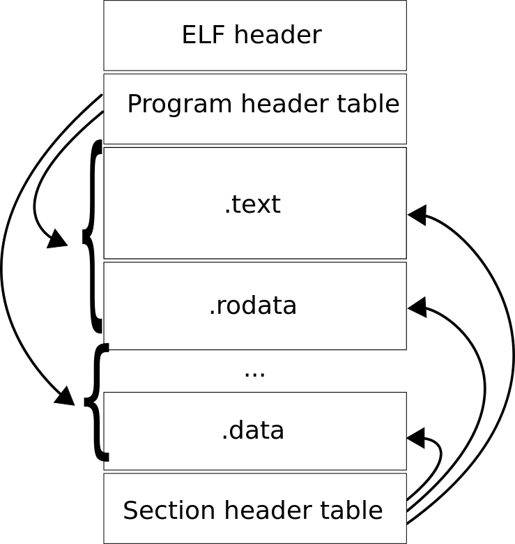

# 第五章 解剖一个程序

每个程序都是由代码和数据组成，且只由这两部分组成。然而，如果一个程序纯粹由代码和数据组成，那么从操作系统（以及人类）的角度来看，就不清楚在一个程序中，二进制的哪一部分是程序，哪一部分只是原始数据，程序是从什么地方开始执行，哪些区域的内存应该被保护，哪些可以自由修改。出于这个原因，每个程序都附带额外的元数据，以便与操作系统理解如何处理这个程序。

当源文件被编译时，生成的机器代码被存储到*对象文件*中，是纯二进制的数据块。一或多个对象文件可以被组合起来，生成*可执行的二进制文件*，它是一个可以在操作系统中运行的完整程序。

`readelf`是一个能够识别并显示二进制文件的ELF元数据的程序，无论这个二进制文件只是对象文件还是可执行程序。`ELF`，即可执行与可链接格式，是位于可执行文件起始位置的内容，旨在为操作系统加载该可执行文件到内存并执行提供必要的信息。ELF与一本书的目录类似。在一本书中，目录列出了主要章节的页码、子章节，有时为了便于查找甚至还提供数字与表格。同样，ELF列出了用作代码和数据的各个节，以及每个符号的内存地址和其他信息。

一个`ELF`二进制文件由以下部分组成：

* *`ELF`头*：可执行文件的首个节，描述了文件的组织结构。
* *程序头表*：是一个固定大小结构体的数组，描述了可执行文件的每个段。
* *节头表*：是一个固定大小结构体的数组，描述可执行文件的每个节。
* *段、节*：段与节是`ELF`二进制文件的主要内容，根据不同的用途分成了代码块和数据块。

*段*是由零个或多个节组成，在运行时直接被操作系统加载。

*节*是一个二进制的块，可以是：

* 在程序运行时可在内存中使用的实际程序代码与数据
* 只在链接过程中使用的描述其他节的元数据，最终并不出现在最终的可执行文件中。

链接器使用节来构建段。



稍后我们将使用`GCC`将我们的内核编译成ELF可执行文件，并通过使用链接器脚本明确指定段的创建方式以及它们在内存中的加载位置，这里的链接器脚本是一个文本文件，指示链接器应该如何生成二进制文件。现在，我们将详细研究ELF可执行文件的结构。

## 5.1 参考文档

在Linux中，*ELF规范*被打包在一个`man`页面中。

```bash
$ man elf
```

这是一个理解、实现`ELF`的有用资源。然而由于规范中掺杂了实现的细节，在您完成这一章之后再使用它会更容易一些。

默认的规范是一个通用的规范，每个`ELF`的实现都遵循它。然而每个平台都提供了特有的额外功能。`x86`的`ELF`规范目前由H. J. Lu在Github上维护：<https://github.com/hjl-tools/x86-psABI/wiki/X86-psABI>。

与特定平台有关的细节在通用`ELF`规范中被称为 "处理器特定（processor specific）"（数据）。我们不会探讨这些细节，而只是研究通用部分，这部分对于为我们的操作系统制作一个`ELF`二进制镜像来说足够了。

## 5.2 `ELF`头

要查看`ELF`头的信息，可以使用：

```bash
$ readelf -h hello
```

得到的可能输出是：

```text
ELF Header:
  Magic:   7f 45 4c 46 02 01 01 00 00 00 00 00 00 00 00 00
  Class:                             ELF64   
  Data:                              2's complement, little endian
  Version                            1 (current)
  OS/ABI:                            UNIX - System V
  ABI Version:                       0
  Type:                              EXEC (Executable file)
  Machine:                           Advanced Micro Devices X86-64
  Version:                           0x1
  Entry point address:               0x400430
  Start of program headers:          64 (bytes into file)
  Start of section headers:          6648 (bytes into file)
  Flags:                             0x0
  Size of this header:               64 (bytes)
  Size of program headers:           56 (bytes)
  Number of program headers:         9
  Size of section headers:           64 (bytes)
  Number of section headers:         31
Section header string table index: 28
```

让我们逐一了解每个字段：

*魔术数字* 表示了唯一标示该文件是一个`ELF`可执行二进制文件。每个字节都给出了一个简短的信息。

示例中，我们有如下的魔法数字字节：

```text
  Magic:   7f 45 4c 46 02 01 01 00 00 00 00 00 00 00 00 00
```

逐个字节检查：

| 字节                      | 描述                                           |
| ------------------------- | --------------------------------------------- |
| `7f 45 4c 46`             | 预设值。首字节总是`7f`，余下字节标示字符串“ELF”。 |
| `02`                      | 详见`Class`字段。                              |
| `01`                      | 详见`Data`字段。                               |
| `01`                      | 详见`Version`字段。                            |
| `00`                      | 详见`OS/ABI`字段。                             |
| `00`                      | 详见`OS/ABI`字段。                             |
| `00 00 00 00 00 00 00 00` | 填充字节。这些字节是未使用的，总是被设置为`0`。填充字节是为了对齐而添加的，并保留给将来需要更多信息的时候使用。 |

*类别* 魔术数字字段中的一个字节。它指定了一个文件的类别或容量。

可能的值有：

| 值  | 描述       |
| --- | --------- |
| `0` | 非法类别。 |
| `1` | 32位对象。 |
| `2` | 64位对象。 |

*数据* 魔术数字字段中的一个字节。它指定了对象文件中处理器特定数据的数据编码。

可能的值有：

| 值  | 描述            |
| --- | --------------- |
| `0` | 非法的数据编码。 |
| `1` | 小端，2的补码。  |
| `2` | 大端，2的补码。  |

*版本* 魔术数字字段中的一个字节。它指定了`ELF`头的版本号。

可能的值有：

| 值  | 描述         |
| --- | ----------- |
| `0` | 非法的版本。 |
| `1` | 当前版本。   |

*OS/ABI* 魔术数字字段中的一个字节。它指定了目标操作系统的应用二进制接口（ABI）。最初，它是一个填充字节。

可能的值：请参考最新的ABI文件，因为列表很长，包含各种不同的操作系统。

*类型* 标示了对象文件类型。

| 值       | 描述               |
| -------- | ------------------ |
| `0`      | 无文件类型。        |
| `1`      | 可重分配文件。      |
| `2`      | 可执行文件。        |
| `3`      | 共享对象文件。      |
| `4`      | 核心文件。          |
| `0xff00` | 处理器特定范围下限。 |
| `0xffff` | 处理器特定范围上限。 |

从`0xff00`到`0xffff`的值是为处理器保留的，用于定义对它有意义的额外文件类型。
  
*设备* 指定了`ELF`文件所需的架构值，例如`x86_64`、`MIPS`、`SPARC`等等。在当前的例子中，*设备*值是`x86_64`架构。

可能的值：请参考最新的ABI文件，因为列表很长，包含各种不同的操作系统。

*版本* 指定了当前对象文件的版本号（它不是之前介绍了的`ELF`头的版本）。

*入口位置* 指定了第一个要执行的代码的内存地址。在普通的应用程序中，默认是`main`函数的地址，但是也可以通过向`gcc`明确指定函数名，让任何函数作为入口。对于我们将要编写的操作系统来说，这是我们引导我们的内核所需要获取的最重要的字段，剩下其余的字段都可以忽略。

*程序头表起点* 即程序头表的偏移量，单位为字节。在当前的例子中，这个数字是`64`字节，这意味着第`65`个字节，即`<起始地址> + 64`，是程序头表的起始地址。也就是说，如果一个程序被加载到内存地址为`0x10000`的位置，那么起始地址就是`0x10000`（魔术数字字段的第一个字节，数值为`0x7f`的位置），程序头表的起始地址为`0x10000 + 0x40 = 0x10040`。

*节头表起点* 节头表的偏移量，单位为字节，与程序头表起点类似。在当前的例子中，它在文件第`6648`字节的地方。

*标志* 保存了与文件相关联的处理器特定标志。当在`x86`设备中加载程序时，EFLAGS寄存器会按照这个值设置。在当前的例子中，这个值为`0x0`，这意味着`EFLAGS`寄存器处于清零状态。

*头的大小* 指定了`ELF`头的总大小，单位为字节。在当前的例子中，它是64字节，与程序头表起点相同。注意，这两个数字不一定相等，因为程序头表可以放在距离`ELF`头很远的地方。`ELF`可执行二进制文件中唯一固定的组件是`ELF`头，它的位置在文件的最开始位置。

*程序头的大小* 指定了每个程序头的大小，单位为字节。在当前的例子中，它是`64`字节。

*程序头的个数* 指定了程序头的总数。在当前的例子中，这个文件总共有`9`个程序头。

*节头的大小* 指定了每个节头的大小，单位为字节。在当前的例子中，它是`64`字节。

*节头的个数* 指定了节头的总数。在当前的例子中，这个文件总共有`31`个节头。在节头表中，表的首个条目总是一个空节。

*字符串表索引节头* 指定了指向存放所有以空结尾字符串的节在节头表中的节头的索引。在当前的例子中，这个索引是`28`，意味着它是表的第`28`项。

## 5.3 节头表

我们已经知道，是代码和数据构成了一个程序。然而，并非所有类型的代码和数据都有着相同的目的。因此，代码和数据不是一个大整块，而是被拆分成了小块，（根据通用ABI）每个小块都必须满足下列这些条件：

* 对象文件中的每一节都正好有一个节头来描述它。但是也有可能存在一些节头，没有与之对应的节。
* 每个节在文件中占据一个连续的字节序列（也可能为空）。这意味着，没有两个区域的字节属于同一节。
* 文件中的节不能重叠。文件中的任何字节不可能同时位于多个节内。
* 对象文件可能包含未使用的空间。各种头与节可能无法“覆盖”对象文件中的每个字节。未使用空间内的数据内容是不明确的。

要从一个可执行的二进制文件——例如`hello`——中获得所有的头，可以使用以下命令：

```bash
$ readelf -S hello
```

下面是一个示例输出（如果你无法理解这些输出，请不要担心。现在只需要稍微熟悉一下。我们很快就会对它进行深入剖析）。

输出：

```text
There are 31 section headers, starting at offset 0x19c8:
Section Headers:
  [Nr] Name              Type             Address           Offset
       Size              EntSize          Flags  Link  Info  Align

  [ 0]                   NULL             0000000000000000  00000000
       0000000000000000  0000000000000000           0     0     0

  [ 1] .interp           PROGBITS         0000000000400238  00000238
       000000000000001c  0000000000000000   A       0     0     1

  [ 2] .note.ABI-tag     NOTE             0000000000400254  00000254
       0000000000000020  0000000000000000   A       0     0     4

  [ 3] .note.gnu.build-i NOTE             0000000000400274  00000274
       0000000000000024  0000000000000000   A       0     0     4

  [ 4] .gnu.hash         GNU_HASH         0000000000400298  00000298
       000000000000001c  0000000000000000   A       5     0     8

  [ 5] .dynsym           DYNSYM           00000000004002b8  000002b8
       0000000000000048  0000000000000018   A       6     1     8

  [ 6] .dynstr           STRTAB           0000000000400300  00000300
       0000000000000038  0000000000000000   A       0     0     1

  [ 7] .gnu.version      VERSYM           0000000000400338  00000338
       0000000000000006  0000000000000002   A       5     0     2

  [ 8] .gnu.version_r    VERNEED          0000000000400340  00000340
       0000000000000020  0000000000000000   A       6     1     8

  [ 9] .rela.dyn         RELA             0000000000400360  00000360
       0000000000000018  0000000000000018   A       5     0     8

  [10] .rela.plt         RELA             0000000000400378  00000378
       0000000000000018  0000000000000018  AI       5    24     8

  [11] .init             PROGBITS         0000000000400390  00000390
       000000000000001a  0000000000000000  AX       0     0     4

  [12] .plt              PROGBITS         00000000004003b0  000003b0
       0000000000000020  0000000000000010  AX       0     0     16

  [13] .plt.got          PROGBITS         00000000004003d0  000003d0
       0000000000000008  0000000000000000  AX       0     0     8

  [14] .text             PROGBITS         00000000004003e0  000003e0
       0000000000000192  0000000000000000  AX       0     0     16

  [15] .fini             PROGBITS         0000000000400574  00000574
       0000000000000009  0000000000000000  AX       0     0     4

  [16] .rodata           PROGBITS         0000000000400580  00000580
       0000000000000004  0000000000000004  AM       0     0     4

  [17] .eh_frame_hdr     PROGBITS         0000000000400584  00000584
       000000000000003c  0000000000000000   A       0     0     4

  [18] .eh_frame         PROGBITS         00000000004005c0  000005c0
       0000000000000114  0000000000000000   A       0     0     8

  [19] .init_array       INIT_ARRAY       0000000000600e10  00000e10
       0000000000000008  0000000000000000  WA       0     0     8

  [20] .fini_array       FINI_ARRAY       0000000000600e18  00000e18
       0000000000000008  0000000000000000  WA       0     0     8

  [21] .jcr              PROGBITS         0000000000600e20  00000e20
       0000000000000008  0000000000000000  WA       0     0     8

  [22] .dynamic          DYNAMIC          0000000000600e28  00000e28
       00000000000001d0  0000000000000010  WA       6     0     8

  [23] .got              PROGBITS         0000000000600ff8  00000ff8
       0000000000000008  0000000000000008  WA       0     0     8

  [24] .got.plt          PROGBITS         0000000000601000  00001000
       0000000000000020  0000000000000008  WA       0     0     8

  [25] .data             PROGBITS         0000000000601020  00001020
       0000000000000010  0000000000000000  WA       0     0     8

  [26] .bss              NOBITS           0000000000601030  00001030
       0000000000000008  0000000000000000  WA       0     0     1

  [27] .comment          PROGBITS         0000000000000000  00001030
       0000000000000034  0000000000000001  MS       0     0     1

  [28] .shstrtab         STRTAB           0000000000000000  000018b6
       000000000000010c  0000000000000000           0     0     1

  [29] .symtab           SYMTAB           0000000000000000  00001068
       0000000000000648  0000000000000018          30    47     8

  [30] .strtab           STRTAB           0000000000000000  000016b0
       0000000000000206  0000000000000000           0     0     1

Key to Flags:
  W (write), A (alloc), X (execute), M (merge), S (strings), l (large)
  I (info), L (link order), G (group), T (TLS), E (exclude), x (unknown)
  O (extra OS processing required) o (OS specific), p (processor specific)
```

第一行：

```text
There are 31 section headers, starting at offset 0x19c8
```

总结了文件中的总节数，以及它的起始地址。然后逐节列出了以下节头，也是每一节输出的格式。

```text
[Nr] Name              Type             Address           Offset
     Size              EntSize          Flags  Link  Info  Align
```

每一节都有两行，各有不同的字段：

*Nr* 每一节的索引。

*Name* 每一节的名称。

*Type* （在节头中）这个字段标示了每个节的类型。类型对节进行分类（类似于编译器所使用的编程语言中的类型）。

*Address* 每一节的起始虚拟地址。请注意，只有当程序运行在一个支持虚拟内存的操作系统中时，这些地址才是虚拟的。在我们的操作系统中，由于运行在裸机上，地址将全部是物理地址。

*Offset* 每一节在文件中的偏移量。偏移量是一个以字节为单位，从文件的第一个字节到一个对象起始位置的距离，这个对象可以是`ELF`二进制文件中的一个节或一个段。

*Size* 每一节的大小。

*EntSize* 有些节保存了一张由固定大小条目构成的表，比如说符号表。对于这样的节，这个成员（按字节）给出了每个条目的大小。如果这个节不包含这样的条目表，那么该成员的值就为`0`。

*Flags* 描述了一个节的属性。标志和类型一起定义了一个节的用途。两个节可以有相同的类型，却有着不同的用途。例如，尽管`.data`和`.text`具有相同的类型，但`.data`保存程序的初始化数据，而`.text`保存程序的可执行指令。由于这个原因，`.data`被赋予了读写权限，但不是可执行的。任何试图在`.data`中执行代码的行为都会被操作系统所拒绝：在Linux中，这样非法地使用区会产生一个段错误(segfault)。

`ELF`提供信息，使操作系统可以启用这种保护机制。然而在裸机上运行，没有什么可以阻止做任何事情。我们的操作系统可以在数据区执行代码，反之也可以写数据到代码区。

表5.3.1 区标志

| 标志 | 描述 |
|------| ---- |
| W    | 这个节中的字节在执行过程中是可以写入的。 |
| A    | 在进程执行过程中为该节分配内存。有些控制节不在对象文件的内存镜像中；对于这些节，这个标志是关闭的。 |
| X    | 这个节包含可执行指令。 |
| M    | 这个节的数据可以出于消除重复的目的被合并。节中的每个元素都要与具有相同名称、类型和标志的其他节的元素进行比较。程序运行时有相同值的元素可以被合并。 |
| S    | 这个节中的数据元素是以空结尾的字符串。每个字符的大小在节头的`EntSize`字段指定。 |
| l    | 标识x86_64架构下的特定大节。通用ABI中没有这个标志，但是在x86_64 ABI中有。 |
| I    | 表明这个节头的`Info`字段包含一个节头的索引。否则，这个数字就是其他东西的索引。 |
| L    | 在链接时保留节的顺序。如果在输出文件中该节与其他节合并，它必须与这些节保持相同的相对顺序，也适用于链接的节与被链接的节的相对顺序。此标志在本节头中的`Link`字段引用另一节（被链接的节）时适用。 |
| G    | 这个节是一个节组的成员（也许是唯一的成员）。 |
| T    | 这个节包含线程本地存储，意味着每个线程都有这份数据的各自独有的实例。线程是一个独立的代码执行流程。一个程序可以有多个线程，这些线程打包不同的代码片断，在同一时间分别执行。在编写内核时，我们将学习更多关于线程的知识。 |
| E    | 当可执行文件和共享库不再被重新定位时，链接编辑器将从它构建的这些资源中排除这个节。 |
| x    | 对`readelf`未知的标志。之所以有这种情况是因为链接过程可以用`GNU ld`这样的链接器手动完成（我们以后会了解）。也就是说，部分标志可以手动指定，而有些标志是转为定制后的`ELF`使用的，那么开源的`readelf`是无法识别的。 |
| O    | 这一节需要特定操作系统的特殊处理（而非标准链接规则）以避免不正确的行为。如果链接编辑器遇到了节头包含了它无法识别的、ELF标准定义的类别或标志值以外的操作系统特定值，那么链接编辑器应该合并这些节。 |
| o    | 这个标志中包含的所有位都是为操作系统特定的语义而保留的。 |
| p    | 这个标志中包括的所有位都保留给处理器特定的语义。如果有指定的含义，处理器的补充说明。 |

*Link* *Info* 是引用节、符号表条目、哈希表条目索引的数字。`Link`字段保存一个节的索引，而`Info`字段根据节的类别保存一个节、一个符号表条目或一个哈希表条目的索引。

稍后在编写操作系统时，我们将通过链接器脚本显式地链接（由`gcc`生成的）对象文件，手工制作内核镜像。我们将通过指定它们在最终映像中出现的地址来指定各节的内存布局。但是我们不会指定任何节的标志，而是让链接器来处理。然而，知道哪个标志是做什么的是很有用的。

*Align* 是一个值，强制要求一个节的偏移量应该被这个值所除。只有`0`和`2`的正整数次方是允许的。值`0`和`1`标识这个节没有对齐约束。

示例5.3.1 `.interp`节的输出：

```text
  [Nr] Name              Type             Address             Offset
       Size              EntSize          Flags  Link  Info    Align

  [ 1] .interp           PROGBITS         0000000000400238    00000238
       000000000000001c  0000000000000000   A       0     0     1
```

`Nr` 是`1`.

`Type` 是`PROGBITS`, 表示这个节是程序的一部分。

`Address` 是`0x0000000000400238`，表示运行时程序被加载在这个虚拟内存地址。

`Offset` 是节位于文件的第`0x00000238`个字节。

`Size` 是`0x000000000000001c`个字节。

`EntSize` 是`0`，表示这个节没有任何固定大小的条目。

`Flags` 是`A`（可分配的），表示这个节在运行时会消耗内存。

`Info` `Link` 分别是`0`和`0`，表示这个节没有链接任何节，或任何表的任何条目。

`Align` 是`1`，表示没有对齐。

示例5.3.1 `.text`节的输出：

```text
  [14] .text             PROGBITS         00000000004003e0    000003e0
         0000000000000192  0000000000000000  AX       0     0       16
```

`Nr` 是`14`.

`Type` 是`PROGBITS`, 表示这个节是程序的一部分。

`Address` 是`0x00000000004003e0`，表示运行时程序被加载在这个虚拟内存地址。

`Offset` 是节位于文件的第`0x000003e0`个字节。

`Size` 是`0x0000000000000192`个字节。

`EntSize` 是`0`，表示这个节没有任何固定大小的条目。

`Flags` 是`A`（可分配的）和`X`，表示这个节在运行时会消耗内存，且可以当作代码执行。

`Info` `Link` 分别是`0`和`0`，表示这个节没有链接任何节，或任何表的任何条目。

`Align` 是`16`，表示这个节的起点地址应当可以被`16`或`0x10`整除。确实：`0x3e0 / 0x10 = 0x3e`。


  Understand Section in-depth

In this section, we will learn different details of section types 
and the purposes of special sections e.g. .bss, .text, .data... 
by looking at each section one by one. We will also examine the 
content of each section as a hexdump with the commands:


$ readelf -x <section name|section number> <file>


For example, if you want to examine the content of section with 
index 25 (the .bss section in the sample output) in the file 
hello:


$ readelf -x 25 hello


Equivalently, using name instead of index works:


$ readelf -x .data hello


If a section contains strings e.g. string symbol table, the flag 
-x can be replaced with -p.

  NULL marks a section header as inactive and does not have an 
  associated section. NULL section is always the first entry of 
  section header table. It means, any useful section starts from 
  1.

  The sample output of NULL section:

    

    [Nr] Name             Type             Address           
    Offset

         Size             EntSize          Flags  Link  Info  
    Align

    [ 0]                  NULL             0000000000000000 
    00000000

         0000000000000000 0000000000000000           0     0     
    0

    

  Examining the content, the section is empty:

  

   Section '' has no data to dump.

  

  NOTE marks a section with special information that other 
  programs will check for conformance, compatibility... by a 
  vendor or a system builder.

  In the sample output, we have 2 NOTE sections:

    

    [Nr] Name              Type             Address           
    Offset

         Size              EntSize          Flags  Link  Info  
    Align

    [ 2] .note.ABI-tag     NOTE             0000000000400254  
    00000254

         0000000000000020  0000000000000000   A       0     0     
    4

    [ 3] .note.gnu.build-i NOTE             0000000000400274  
    00000274          

         0000000000000024  0000000000000000   A       0     0     
    4

    

  Examine 2nd section with the command:

  

  $ readelf -x 2 hello

  

  we have:

  

  Hex dump of section '.note.ABI-tag':

    0x00400254 04000000 10000000 01000000 474e5500 
  ............GNU.

    0x00400264 00000000 02000000 06000000 20000000 ............ 
  ...

  

  PROGBITS indicates a section holding the main content of a 
  program, either code or data.

  There are many PROGBITS sections:

    

      [Nr] Name              Type             Address           
    Offset

           Size              EntSize          Flags  Link  Info  
    Align

      [ 1] .interp           PROGBITS         0000000000400238  
    00000238

           000000000000001c  0000000000000000   A       0     0   
      1

      ...

      [11] .init             PROGBITS         0000000000400390  
    00000390

           000000000000001a  0000000000000000  AX       0     0   
      4

      [12] .plt              PROGBITS         00000000004003b0  
    000003b0

           0000000000000020  0000000000000010  AX       0     0   
      16

      [13] .plt.got          PROGBITS         00000000004003d0  
    000003d0

           0000000000000008  0000000000000000  AX       0     0   
      8

      [14] .text             PROGBITS         00000000004003e0  
    000003e0

           0000000000000192  0000000000000000  AX       0     0   
      16

      [15] .fini             PROGBITS         0000000000400574  
    00000574

           0000000000000009  0000000000000000  AX       0     0   
      4

      [16] .rodata           PROGBITS         0000000000400580  
    00000580

           0000000000000004  0000000000000004  AM       0     0   
      4

      [17] .eh_frame_hdr     PROGBITS         0000000000400584  
    00000584

           000000000000003c  0000000000000000   A       0     0   
      4

      [18] .eh_frame         PROGBITS         00000000004005c0  
    000005c0

           0000000000000114  0000000000000000   A       0     0   
      8

      ...

      [23] .got              PROGBITS         0000000000600ff8  
    00000ff8

           0000000000000008  0000000000000008  WA       0     0   
      8

      [24] .got.plt          PROGBITS         0000000000601000  
    00001000

           0000000000000020  0000000000000008  WA       0     0   
      8

      [25] .data             PROGBITS         0000000000601020  
    00001020

           0000000000000010  0000000000000000  WA       0     0   
      8

      [27] .comment          PROGBITS         0000000000000000  
    00001030

           0000000000000034  0000000000000001  MS       0     0   
      1

    

  For our operating system, we only need the following section:

  .text

    This section holds all the compiled code of a program. 

  .data

    This section holds the initialized data of a program. Since 
    the data are initialized with actual values, gcc allocates 
    the section with actual byte in the executable binary.

  .rodata

    This section holds read-only data, such as fixed-size strings 
    in a program, e.g. “Hello World”, and others.

  .bss

    This section, shorts for Block Started by Symbol, holds 
    uninitialized data of a program. Unlike other sections, no 
    space is allocated for this section in the image of the 
    executable binary on disk. The section is allocated only when 
    the program is loaded into main memory.

  Other sections are mainly needed for dynamic linking, that is 
  code linking at runtime for sharing between many programs. To 
  enable such feature, an OS as a runtime environment must be 
  presented. Since we run our OS on bare metal, we are 
  effectively creating such environment. For simplicity, we won't 
  add dynamic linking to our OS.

  SYMTAB and DYNSYM These sections hold symbol table. A symbol 
  table is an array of entries that describe symbols in a 
  program. A symbol is a name assigned to an entity in a program. 
  The types of these entities are also the types of symbols, and 
  these are the possible types of an entity:

  In the sample output, section 5 and 29 are symbol tables:

    

    [Nr] Name              Type             Address           
    Offset

         Size              EntSize          Flags  Link  Info  
    Align

    [ 5] .dynsym           DYNSYM           00000000004002b8  
    000002b8

         0000000000000048  0000000000000018   A       6     1     
    8

    ...

    [29] .symtab           SYMTAB           0000000000000000  
    00001068

         0000000000000648  0000000000000018          30    47     
    8

    

    To show the symbol table:

    

    $ readelf -s hello

    

    Output consists of 2 symbol tables, corresponding to the two 
    sections above, .dynsym and .symtab:

    

    Symbol table '.dynsym' contains 4 entries:

       Num:    Value          Size Type    Bind   Vis      Ndx 
    Name

         0: 0000000000000000     0 NOTYPE  LOCAL  DEFAULT  UND 

         1: 0000000000000000     0 FUNC    GLOBAL DEFAULT  UND 
    puts@GLIBC_2.2.5 (2)

         2: 0000000000000000     0 FUNC    GLOBAL DEFAULT  UND 
    __libc_start_main@GLIBC_2.2.5 (2)

         3: 0000000000000000     0 NOTYPE  WEAK   DEFAULT  UND 
    __gmon_start__

    Symbol table '.symtab' contains 67 entries:

       Num:    Value          Size Type    Bind   Vis      Ndx 
    Name

        ..........................................

        59: 0000000000601040     0 NOTYPE  GLOBAL DEFAULT   26 
    _end

        60: 0000000000400430    42 FUNC    GLOBAL DEFAULT   14 
    _start

        61: 0000000000601038     0 NOTYPE  GLOBAL DEFAULT   26 
    __bss_start

        62: 0000000000400526    32 FUNC    GLOBAL DEFAULT   14 
    main

        63: 0000000000000000     0 NOTYPE  WEAK   DEFAULT  UND 
    _Jv_RegisterClasses

        64: 0000000000601038     0 OBJECT  GLOBAL HIDDEN    25 
    __TMC_END__

        65: 0000000000000000     0 NOTYPE  WEAK   DEFAULT  UND 
    _ITM_registerTMCloneTable

        66: 00000000004003c8     0 FUNC    GLOBAL DEFAULT   11 
    _init

    

  TLS	The symbol is associated with a Thread-Local Storage 
    entity.

  Num is the index of an entry in a table.

  Value is the virtual memory address where the symbol is 
    located.

  Size is the size of the entity associated with a symbol.

  Type is a symbol type according to table.

    NOTYPE The type of a symbol is not specified. 

    OBJECT	The symbol is associated with a data object. In C, any 
      variable definition is of OBJECT type.

    FUNC The symbol is associated with a function or other 
      executable code. 

    SECTION	The symbol is associated with a section, and exists 
      primarily for relocation.

    FILE The symbol is the name of a source file associated with 
      an executable binary.

    COMMON	The symbol labels an uninitialized variable. That is, 
      when a variable in C is defined as global variable without 
      an initial value, or as an external variable using the 
      extern keyword. In other words, these variables stay in 
      .bss section.

  Bind is the scope of a symbol. 

    LOCAL are symbols that are only visible in the object files 
      that defined them. In C, the static modifier marks a symbol 
      (e.g. a variable/function) as local to only the file that 
      defines it.

      If we define variables and functions with static modifer:

        static int global_static_var = 0;


static void local_func() {

}


int main(int argc, char *argv[])

{

    static int local_static_var = 0;


    return 0;

}

      Then we get the static variables listed as local symbols 
      after compiling:

        

        $ gcc -m32 hello.c -o hello

        $ readelf -s hello

        

        

        Symbol table '.dynsym' contains 5 entries:

           Num:    Value  Size Type    Bind   Vis      Ndx Name

             0: 00000000     0 NOTYPE  LOCAL  DEFAULT  UND 

             1: 00000000     0 FUNC    GLOBAL DEFAULT  UND 
        puts@GLIBC_2.0 (2)

             2: 00000000     0 NOTYPE  WEAK   DEFAULT  UND 
        __gmon_start__

             3: 00000000     0 FUNC    GLOBAL DEFAULT  UND 
        __libc_start_main@GLIBC_2.0 (2)

             4: 080484bc     4 OBJECT  GLOBAL DEFAULT   16 
        _IO_stdin_used

        Symbol table '.symtab' contains 72 entries:

           Num:    Value  Size Type    Bind   Vis      Ndx Name

             0: 00000000     0 NOTYPE  LOCAL  DEFAULT  UND 

                ......... output omitted .........

            38: 0804a020     4 OBJECT  LOCAL  DEFAULT   26 
        global_static_var

            39: 0804840b     6 FUNC    LOCAL  DEFAULT   14 
        local_func

            40: 0804a024     4 OBJECT  LOCAL  DEFAULT   26 
        local_static_var.1938

         ......... output omitted .........

        

    GLOBAL	are symbols that are accessible by other object files 
      when linking together. These symbols are primarily 
      non-static functions and non-static global data. The extern 
      modifier marks a symbol as externally defined elsewhere but 
      is accessible in the final executable binary, so an extern 
      variable is also considered GLOBAL.

      Similar to the LOCAL example above, the output lists many 
      GLOBAL symbols such as main:

        Num:    Value  Size Type    Bind   Vis      Ndx Name

        ......... output omitted .........

         66: 080483e1    10 FUNC    GLOBAL DEFAULT   14 main

        ......... output omitted .........

    WEAK are symbols whose definitions can be redefined. 
      Normally, a symbol with multiple definitions are reported 
      as an error by a compiler. However, this constraint is lax 
      when a definition is explicitly marked as weak, which means 
      the default implementation can be replaced by a different 
      definition at link time.

      Suppose we have a default implementation of the function 
      add:

        #include <stdio.h>


__attribute__((weak)) int add(int a, int b) {

    printf("warning: function is not implemented.\n");

    return 0;

}


int main(int argc, char *argv[])

{

    printf("add(1,2) is %d\n", add(1,2));

    return 0;

}

        __attribute__((weak)) is a [margin:
function attribute
]function attribute. A function attributefunction attribute is 
        extra information for a compiler to handle a function 
        differently from a normal function. In this example, weak 
        attribute makes the function add a weak function,which 
        means the default implementation can be replaced by a 
        different definition at link time. Function attribute is 
        a feature of a compiler, not standard C.

        If we do not supply a different function definition in a 
        different file (must be in a different file, otherwise 
        gcc reports as an error), then the default implementation 
        is applied. When the function add is called, it only 
        prints the message: "warning: function not 
        implemented"and returns 0:

        

        $ ./hello 

        warning: function is not implemented.

        add(1,2) is 0

        

        However, if we supply a different definition in another 
        file e.g. math.c:

        int add(int a, int b) {

    return a + b;

}

        and compile the two files together:

        

        $ gcc math.c hello.c -o hello

        

        Then, when running hello, no warning message is printed 
        and the correct value is returned.

        Weak symbol is a mechanism to provide a default 
        implementation, but replaceable when a better 
        implementation is available (e.g. more specialized and 
        optimized) at link-time.

  Vis is the visibility of a symbol. The following values are 
    available:

    
                                                                                                                                  [Table 6:
Symbol Visibility
]                                                                                                                                   
    +------------+-----------------------------------------------------------------------------------------------------------------------------------------------------------------------------------------------------------------------------------------------------------------------------------+
    | Value      | Description                                                                                                                                                                                                                                                                       |
    +------------+-----------------------------------------------------------------------------------------------------------------------------------------------------------------------------------------------------------------------------------------------------------------------------------+
    +------------+-----------------------------------------------------------------------------------------------------------------------------------------------------------------------------------------------------------------------------------------------------------------------------------+
    | DEFAULT    | The visibility is specified by the binding type of asymbol. 

• Global and weak symbols are visible outside of their defining 
  component (executable file or shared object).

• Local symbols are hidden. See HIDDEN below.                                                     |
    +------------+-----------------------------------------------------------------------------------------------------------------------------------------------------------------------------------------------------------------------------------------------------------------------------------+
    | HIDDEN     | A symbol is hidden when the name is not visible to any other 
program outside of its running program.                                                                                                                                                                             |
    +------------+-----------------------------------------------------------------------------------------------------------------------------------------------------------------------------------------------------------------------------------------------------------------------------------+
    | PROTECTED  | A symbol is protected when it is shared outside of its running 
program or shared libary and cannot be overridden. That is, there 
can only be one definition for this symbol across running 
programs that use it. No program can define its own definition of 
the same symbol. |
    +------------+-----------------------------------------------------------------------------------------------------------------------------------------------------------------------------------------------------------------------------------------------------------------------------------+
    | INTERNAL   | Visibility is processor-specific and is defined by 
processor-specific ABI.                                                                                                                                                                                                       |
    +------------+-----------------------------------------------------------------------------------------------------------------------------------------------------------------------------------------------------------------------------------------------------------------------------------+
    

  Ndx is the index of a section that the symbol is in. Aside from 
    fixed index numbers that represent section indexes, index has 
    these special values:

    
                                                                                                                                                 [Table 7:
Symbol Index
]                                                                                                                                                 
    +-----------------------+------------------------------------------------------------------------------------------------------------------------------------------------------------------------------------------------------------------------------------------------------------------------------------------------+
    | Value                 | Description                                                                                                                                                                                                                                                                                    |
    +-----------------------+------------------------------------------------------------------------------------------------------------------------------------------------------------------------------------------------------------------------------------------------------------------------------------------------+
    +-----------------------+------------------------------------------------------------------------------------------------------------------------------------------------------------------------------------------------------------------------------------------------------------------------------------------------+
    | ABS                   | The index will not be changed by any symbol relocation.                                                                                                                                                                                                                                        |
    +-----------------------+------------------------------------------------------------------------------------------------------------------------------------------------------------------------------------------------------------------------------------------------------------------------------------------------+
    | COM                   | The index refers to an unallocated common block.                                                                                                                                                                                                                                               |
    +-----------------------+------------------------------------------------------------------------------------------------------------------------------------------------------------------------------------------------------------------------------------------------------------------------------------------------+
    | UND                   | The symbol is undefined in the current object file, which means 
the symbol depends on the actual definition in another file. 
Undefined symbols appears when the object file refers to symbols 
that are available at runtime, from shared library.                                           |
    +-----------------------+------------------------------------------------------------------------------------------------------------------------------------------------------------------------------------------------------------------------------------------------------------------------------------------------+
    | LORESERVE

HIRESERVE  | LORESERVE is the lower boundary of the reserve indexes. Its value 
is 0xff00.

HIREVERSE is the upper boundary of the reserve indexes. Its value 
is 0xffff.

The operating system reserves exclusive indexes between LORESERVE 
and HIRESERVE, which do not map to any actual section header. |
    +-----------------------+------------------------------------------------------------------------------------------------------------------------------------------------------------------------------------------------------------------------------------------------------------------------------------------------+
    | XINDEX                | The index is larger than LORESERVE. The actual value will be 
contained in the section SYMTAB_SHNDX, where each entry is a 
mapping between a symbol, whose Ndx field is a XINDEX value, and 
the actual index value.                                                                          |
    +-----------------------+------------------------------------------------------------------------------------------------------------------------------------------------------------------------------------------------------------------------------------------------------------------------------------------------+
    | Others                | Sometimes, values such as ANSI_COM, LARGE_COM, SCOM, SUND appear. 
This means that the index is processor-specific.                                                                                                                                                                            |
    +-----------------------+------------------------------------------------------------------------------------------------------------------------------------------------------------------------------------------------------------------------------------------------------------------------------------------------+
    

  Name is the symbol name.

  A C application program always starts from symbol main. The 
  entry for main in the symbol table in .symtab section is:

    

    Num:                Value  Size Type    Bind   Vis      Ndx 
    Name

     62:     0000000000400526    32 FUNC    GLOBAL DEFAULT   14 
    main

    

  The entry shows that:

  • main is the 62[superscript:th] entry in the table.

  • main starts at address 0x0000000000400526.

  • main consumes 32 bytes.

  • main is a function.

  • main is in global scope.

  • main is visible to other object files that use it.

  • main is inside the 14[superscript:th] section, which is .text. This is logical, since .text holds all 
    program code.

  STRTAB hold a table of null-terminated strings, called string 
  table. The first and last byte of this section is always a NULL 
  character. A string table section exists because a string can 
  be reused by more than one section to represent symbol and 
  section names, so a program like readelf or objdump can display 
  various objects in a program, e.g. variable, functions, section 
  names, in a human-readable text instead of its raw hex address.

  In the sample output, section 28 and 30 are of STRTAB type:

    

    [Nr] Name              Type             Address           
    Offset

         Size              EntSize          Flags  Link  Info  
    Align

    [28] .shstrtab         STRTAB           0000000000000000  
    000018b6

         000000000000010c  0000000000000000           0     0     
    1

    [30] .strtab           STRTAB           0000000000000000  
    000016b0

         0000000000000206  0000000000000000           0     0     
    1

    

  .shstrtab holds all the section names.

  .strtab holds the symbols e.g. variable names, function names, 
    struct names, etc., in a C program, but not fixed-size 
    null-terminated C strings; the C strings are kept in .rodata 
    section.

  Strings in those section can be inspected with the command:

    

    $ readelf -p 29 hello

    

    The output shows all the section names, with the offset (also 
    the string index) into .shstrtab the table to the left:

    

    String dump of section '.shstrtab':  

      [     1]  .symtab

      [     9]  .strtab

      [    11]  .shstrtab

      [    1b]  .interp

      [    23]  .note.ABI-tag

      [    31]  .note.gnu.build-id

      [    44]  .gnu.hash

      [    4e]  .dynsym

      [    56]  .dynstr

      [    5e]  .gnu.version

      [    6b]  .gnu.version_r

      [    7a]  .rela.dyn

      [    84]  .rela.plt

      [    8e]  .init

      [    94]  .plt.got

      [    9d]  .text

      [    a3]  .fini

      [    a9]  .rodata

      [    b1]  .eh_frame_hdr

      [    bf]  .eh_frame

      [    c9]  .init_array

      [    d5]  .fini_array

      [    e1]  .jcr

      [    e6]  .dynamic

      [    ef]  .got.plt

      [    f8]  .data

      [    fe]  .bss

      [   103]  .comment

    

    The actual implementation of a string table is a contiguous 
    array of null-terminated strings. The index of a string is 
    the position of its first character in the array. For 
    example, in the above string table, .symtab is at index 1 in 
    the array (NULL character is at index 0). The length of 
    .symtab is 7, plus the NULL character, which occurs 8 bytes 
    in total. So, .strtab starts at index 9, and so on.

    

    
            +-----+-----+-----+-----+-----+-----+-----+-----+-----+-----+-----+-----+-----+-----+-----+----+
                | 00  | 01  | 02  | 03  | 04  | 05  | 06  | 07  | 08  | 09  | 0a  | 0b  | 0c  | 0d  | 0e  | 0f |
    +-----------+-----+-----+-----+-----+-----+-----+-----+-----+-----+-----+-----+-----+-----+-----+-----+----+
    | 00000000  | \0  | .   | s   | y   | m   | t   | a   | b   | \0  | .   | s   | t   | r   | t   | a   | b  |
    +-----------+-----+-----+-----+-----+-----+-----+-----+-----+-----+-----+-----+-----+-----+-----+-----+----+
                                                                                                                
                +-----+-----+-----+-----+-----+-----+-----+-----+-----+-----+-----+-----+-----+-----+-----+----+
                | 00  | 01  | 02  | 03  | 04  | 05  | 06  | 07  | 08  | 09  | 0a  | 0b  | 0c  | 0d  | 0e  | 0f |
    +-----------+-----+-----+-----+-----+-----+-----+-----+-----+-----+-----+-----+-----+-----+-----+-----+----+
    | 00000010  | \0  | .   | s   | h   | s   | t   | r   | t   | a   | b   | \0  | .   | i   | n   | t   | e  |
    +-----------+-----+-----+-----+-----+-----+-----+-----+-----+-----+-----+-----+-----+-----+-----+-----+----+
                                                .... and so on ....                                             
    

    

    


    Similarly, the output of .strtab:

    

    String dump of section '.strtab':

      [     1]  crtstuff.c

      [     c]  __JCR_LIST__

      [    19]  deregister_tm_clones

      [    2e]  __do_global_dtors_aux

      [    44]  completed.7585

      [    53]  __do_global_dtors_aux_fini_array_entry

      [    7a]  frame_dummy

      [    86]  __frame_dummy_init_array_entry

      [    a5]  hello.c

      [    ad]  __FRAME_END__

      [    bb]  __JCR_END__

      [    c7]  __init_array_end

      [    d8]  _DYNAMIC

      [    e1]  __init_array_start

      [    f4]  __GNU_EH_FRAME_HDR

      [   107]  _GLOBAL_OFFSET_TABLE_

      [   11d]  __libc_csu_fini

      [   12d]  _ITM_deregisterTMCloneTable

      [   149]  j

      [   14b]  _edata

      [   152]  __libc_start_main@@GLIBC_2.2.5

      [   171]  __data_start

      [   17e]  __gmon_start__

      [   18d]  __dso_handle

      [   19a]  _IO_stdin_used

      [   1a9]  __libc_csu_init

      [   1b9]  __bss_start

      [   1c5]  main

      [   1ca]  _Jv_RegisterClasses

      [   1de]  __TMC_END__

      [   1ea]  _ITM_registerTMCloneTable

    

  HASH holds a symbol hash table, which supports symbol table 
  access.

  DYNAMIC holds information for dynamic linking. 

  NOBITS is similar to PROGBITS but occupies no space.

  .bss section holds uninitialized data, which means the bytes in 
  the section can have any value. Until a operating system 
  actually loads the section into main memory, there is no need 
  to allocate space for the binary image on disk to reduce the 
  size of a binary file. Here is the details of .bss from the 
  example output:

  

  [Nr] Name              Type             Address           
  Offset

       Size              EntSize          Flags  Link  Info  
  Align

  [26] .bss              NOBITS           0000000000601038  
  00001038

       0000000000000008  0000000000000000  WA       0     0     1 
    

  [27] .comment          PROGBITS         0000000000000000  
  00001038

       0000000000000034  0000000000000001  MS       0     0     1 

  

  In the above output, the size of the section is only 8 bytes, 
  while the offsets of both sections are the same, which means 
  .bss consumes no byte of the executable binary on disk. 

  Notice that the .comment section has no starting address. This 
  means that this section is discarded when the executable binary 
  is loaded into memory.

  REL holds relocation entries without explicit addends. This 
  type will be explained in details in [sec:Understand-relocations-with-readelf]

  RELA holds relocation entries with explicit addends. This type 
  will be explained in details in [sec:Understand-relocations-with-readelf]

  INIT_ARRAY is an array of function pointers for program 
  initialization. When an application program runs, before 
  getting to main(), initialization code in .init and this 
  section are executed first. The first element in this array is 
  an ignored function pointer. 

  It might not make sense when we can include initialization code 
  in the main() function. However, for shared object files where 
  there are no main(), this section ensures that the 
  initialization code from an object file executes before any 
  other code to ensure a proper environment for main code to run 
  properly. It also makes an object file more modularity, as the 
  main application code needs not to be responsible for 
  initializing a proper environment for using a particular object 
  file, but the object file itself. Such a clear division makes 
  code cleaner.

  However, we will not use any .init and INIT_ARRAY sections in 
  our operating system, for simplicity, as initializing an 
  environment is part of the operating-system domain.

  To use the INIT_ARRAY, we simply mark a function with the 
  attribute constructor:

    #include <stdio.h>


__attribute__((constructor)) static void init1(){

    printf("%s\n", __FUNCTION__);

}


__attribute__((constructor)) static void init2(){

    printf("%s\n", __FUNCTION__);

}


int main(int argc, char *argv[])

{

    printf("hello world\n");


    return 0;

}

    The program automatically calls the constructor without 
    explicitly invoking it:

    

    $ gcc -m32 hello.c -o hello

    $ ./hello 

    init1

    init2

    hello world

    

  

  Optionally, a constructor can be assigned with a priority from 
  101 onward. The priorities from 0 to 100 are reserved for gcc. 
  If we want init2 to run before init1, we give it a higher 
  priority:

    #include <stdio.h>


__attribute__((constructor(102))) static void init1(){

    printf("%s\n", __FUNCTION__);

}


__attribute__((constructor(101))) static void init2(){

    printf("%s\n", __FUNCTION__);

}


int main(int argc, char *argv[])

{

    printf("hello world\n");


    return 0;

}

    The call order should be exactly as specified:

  

  $ gcc -m32 hello.c -o hello

  $ ./hello

  init2

  init1

  hello world

  

  

  We can add initialization functions using another method:

    #include <stdio.h>


void init1() {

    printf("%s\n", __FUNCTION__);

}


void init2() {

    printf("%s\n", __FUNCTION__);

}


/* Without typedef, init is a definition of a function pointer.

   With typedef, init is a declaration of a type.*/

typedef void (*init)();


__attribute__((section(".init_array"))) init init_arr[2] = 
{init1, init2};


int main(int argc, char *argv[])

{

    printf("hello world!\n");


    return 0;

}

    The attribute section(“...”) put a function into a particular 
    section rather then the default .text. In this example, it is 
    .init_arary. Again, the program automatically calls the 
    constructors without explicitly invoking it:

    

    $ gcc -m32 hello.c -o hello

    $ ./hello 

    init1

  init2

  hello world!

    

  FINI_ARRAY is an array of function pointers for program 
  termination, called after exiting main(). If the application 
  terminate abnormally, such as through abort() call or a crash, 
  the .finit_array is ignored.

  A destructor is automatically called after exiting main(), if 
  one or more available:

  #include <stdio.h>


__attribute__((destructor)) static void destructor(){

    printf("%s\n", __FUNCTION__);

}


int main(int argc, char *argv[])

{

    printf("hello world\n");


    return 0;

}

  

  $ gcc -m32 hello.c -o hello

  $ ./hello 

  hello world

  destructor

  

  PREINIT_ARRAY is an array of function pointers that are invoked 
  before all other initialization functions in INIT_ARRAY.

  To use the .preinit_array, the only way to put functions into 
  this section is to use the attribute section():

  #include <stdio.h>


void preinit1() {

    printf("%s\n", __FUNCTION__);

}


void preinit2() {

    printf("%s\n", __FUNCTION__);

}


void init1() {

    printf("%s\n", __FUNCTION__);

}


void init2() {

    printf("%s\n", __FUNCTION__);

}


typedef void (*preinit)();

typedef void (*init)();


__attribute__((section(".preinit_array"))) preinit preinit_arr[2] = 
{preinit1, preinit2};

__attribute__((section(".init_array"))) init init_arr[2] = 
{init1, init2};


int main(int argc, char *argv[])

{

    printf("hello world!\n");


    return 0;

}

  

  $ gcc -m32 hello2.c -o hello2

  $ ./hello2

  preinit1

  preinit2

  init1

  init2

  hello world!

  

  GROUP defines a section group, which is the same section that 
  appears in different object files but when merged into the 
  final executable binary file, only one copy is kept and the 
  rest in other object files are discarded. This section is only 
  relevant in C++ object files, so we will not examine further.

  SYMTAB_SHNDX is a section containing extended section indexes, 
  that are associated with a symbol table. This section only 
  appears when the Ndx value of an entry in the symbol table 
  exceeds the LORESERVE value. This section then maps between a 
  symbol and an actual index value of a section header.

Upon understanding section types, we can understand the number in 
Link and Info fields:


+-----------------+--------------------------------------------------------------------------------+---------------------------------------------------------------------------------------------------------------------------------------------------------+
| Type            | Link                                                                           | Info                                                                                                                                                    |
+-----------------+--------------------------------------------------------------------------------+---------------------------------------------------------------------------------------------------------------------------------------------------------+
+-----------------+--------------------------------------------------------------------------------+---------------------------------------------------------------------------------------------------------------------------------------------------------+
| DYNAMIC         | Entries in this section uses the section index of the dynamic 
string table.   | 0                                                                                                                                                       |
+-----------------+--------------------------------------------------------------------------------+---------------------------------------------------------------------------------------------------------------------------------------------------------+
| HASH

GNU_HASH  | The section index of the symbol table to which the hash table 
applies.        | 0                                                                                                                                                       |
+-----------------+--------------------------------------------------------------------------------+---------------------------------------------------------------------------------------------------------------------------------------------------------+
| REL

RELA       | The section index of the associated symbol table.                              | The section index to which the relocation applies.                                                                                                      |
+-----------------+--------------------------------------------------------------------------------+---------------------------------------------------------------------------------------------------------------------------------------------------------+
| SYMTAB

DYNSYM  | The section index of the associated string table.                              | One greater than the symbol table index of the last local symbol.                                                                                       |
+-----------------+--------------------------------------------------------------------------------+---------------------------------------------------------------------------------------------------------------------------------------------------------+
| GROUP           | The section index of the associated symbol table.                              | The symbol index of an entry in the associated symbol table. The 
name of the specified symbol table entry provides a signature for 
the section group. |
+-----------------+--------------------------------------------------------------------------------+---------------------------------------------------------------------------------------------------------------------------------------------------------+
| SYMTAB_SHNDX    | The section header index of the associated symbol table.                       |                                                                                                                                                         |
+-----------------+--------------------------------------------------------------------------------+---------------------------------------------------------------------------------------------------------------------------------------------------------+


Verify that the value of the Link field of a SYMTAB section is 
the index of a STRTAB section.


Verify that the value of the Info field of a SYMTAB section is 
the index of last local symbol + 1. It means, in the symbol 
table, from the index listed by Info field onward, no local 
symbol appears.


Verify that the value of the Info field of a REL section is the 
index of the SYMTAB section.


Verify that the value of the Link field of a REL section is the 
index of the section where relocation is applied. For example. if 
the section is .rel.text, then the relocating section should be 
.text.

  Program header table<sec:Program-header-table>

A program header tableprogram header table is an array of program 
headers that defines the memory layout of a program at runtime. 

A program headerprogram header is a description of a program 
segment.

A program segmentprogram segment is a collection of related 
sections. A segment contains zero or more sections. An operating 
system when loading a program, only use segments, not sections. 
To see the information of a program header table, we use the -l 
option with readelf:


$ readelf -l <binary file>


Similar to a section, a program header also has types:

  PHDR specifies the location and size of the program header 
  table itself, both in the file and in the memory image of the 
  program

  INTERP specifies the location and size of a null-terminated 
  path name to invoke as an interpreter for linking runtime 
  libraries.

  LOAD specifies a loadable segment. That is, this segment is 
  loaded into main memory.

  DYNAMIC specifies dynamic linking information.

  NOTE specifies the location and size of auxiliary information.

  TLS specifies the Thread-Local Storage template, which is 
  formed from the combination of all sections with the flag TLS.

  GNU_STACK indicates whether the program's stack should be made 
  executable or not. Linux kernel uses this type.

A segment also has permission, which is a combination of these 3 
values:[float MarginTable:
[MarginTable 3:
Segment Permission
]


+-------------+-------------+
| Permission  | Description |
+-------------+-------------+
+-------------+-------------+
| R           | Readable    |
+-------------+-------------+
| W           | Writable    |
+-------------+-------------+
| E           | Executable  |
+-------------+-------------+

]

• Read (R)

• Write (W)

• Execute (E)


-------------------------------------------


The command to get the program header table:

  

  $ readelf -l hello

  

  Output:

  

  Elf file type is EXEC (Executable file)

  Entry point 0x400430

  There are 9 program headers, starting at offset 64

  

  Program Headers:

    Type           Offset             VirtAddr           PhysAddr

                   FileSiz            MemSiz              Flags  
  Align

    PHDR           0x0000000000000040 0x0000000000400040 
  0x0000000000400040

                   0x00000000000001f8 0x00000000000001f8  R E    
  8

    INTERP         0x0000000000000238 0x0000000000400238 
  0x0000000000400238

                   0x000000000000001c 0x000000000000001c  R      
  1

        [Requesting program interpreter: 
  /lib64/ld-linux-x86-64.so.2]

    LOAD           0x0000000000000000 0x0000000000400000 
  0x0000000000400000

                   0x000000000000070c 0x000000000000070c  R E    
  200000

    LOAD           0x0000000000000e10 0x0000000000600e10 
  0x0000000000600e10

                   0x0000000000000228 0x0000000000000230  RW     
  200000

    DYNAMIC        0x0000000000000e28 0x0000000000600e28 
  0x0000000000600e28

                   0x00000000000001d0 0x00000000000001d0  RW     
  8

    NOTE           0x0000000000000254 0x0000000000400254 
  0x0000000000400254

                   0x0000000000000044 0x0000000000000044  R      
  4

    GNU_EH_FRAME   0x00000000000005e4 0x00000000004005e4 
  0x00000000004005e4

                   0x0000000000000034 0x0000000000000034  R      
  4

    GNU_STACK      0x0000000000000000 0x0000000000000000 
  0x0000000000000000

                   0x0000000000000000 0x0000000000000000  RW     
  10

    GNU_RELRO      0x0000000000000e10 0x0000000000600e10 
  0x0000000000600e10

                   0x00000000000001f0 0x00000000000001f0  R      
  1

  

   Section to Segment mapping:

    Segment Sections...

     00     

     01     .interp

     02     .interp .note.ABI-tag .note.gnu.build-id .gnu.hash 
  .dynsym .dynstr 

  .gnu.version .gnu.version_r .rela.dyn .rela.plt .init .plt 
  .plt.got .text .fini

  .rodata .eh_frame_hdr .eh_frame 

     03     .init_array .fini_array .jcr .dynamic .got .got.plt 
  .data .bss 

     04     .dynamic 

     05     .note.ABI-tag .note.gnu.build-id 

     06     .eh_frame_hdr 

     07     

     08     .init_array .fini_array .jcr .dynamic .got 

  

  In the sample output, LOAD segment appears twice:

  

  LOAD           0x0000000000000000 0x0000000000400000 
  0x0000000000400000

                 0x000000000000070c 0x000000000000070c  R E    
  200000

  LOAD           0x0000000000000e10 0x0000000000600e10 
  0x0000000000600e10

                 0x0000000000000228 0x0000000000000230  RW     
  200000

  

  Why? Notice the permission: 

  • the upper LOAD has Read and Execute permission. This is a 
    text segment. A text segment contains read-only instructions 
    and read-only data.

  • the lower LOAD has Read and Write permission. This is a data 
    segment. It means that this segment can be read and written 
    to, but is not allowed to be used as executable code, for 
    security reason.

  Then, LOAD contains the following sections:

  

     02     .interp .note.ABI-tag .note.gnu.build-id .gnu.hash 
  .dynsym .dynstr 

  .gnu.version .gnu.version_r .rela.dyn .rela.plt .init .plt 
  .plt.got .text .fini 

  .rodata .eh_frame_hdr .eh_frame 

     03     .init_array .fini_array .jcr .dynamic .got .got.plt 
  .data .bss 

  

  The first number is the index of a program header in program 
  header table, and the remaining text is the list of all 
  sections within a segment. Unfortunately, readelf does not 
  print the index, so a user needs to keep track manually which 
  segment is of which index. First segment starts at index 0, 
  second at index 1 and so on. LOAD are segments at index 2 and 
  1. As can be seen from the two lists of sections, most sections 
  are loadable and is available at runtime.


-------------------------------------------


  Segments vs sections

As mentioned earlier, an operating system loads program segments, 
not sections. However, a question arises: Why doesn't the 
operating system use sections instead? After all, a section also 
contains similar information to a program segment, such as the 
type, the virtual memory address to be loaded, the size, the 
attributes, the flags and align. As explained before, a segment 
is the perspective of an operating system, while a section is the 
perspective of a linker. To understand why, looking into the 
structure of a segment, we can easily see:

• A segment is a collection of sections. It means that sections 
  are logically grouped together by their attributes. For 
  example, all sections in a LOAD segment are always loaded by 
  the operating system; all sections have the same permission, 
  either a RE (Read + Execute) for executable sections, or RW 
  (Read + Write) for data sections.

• By grouping sections into a segment, it is easier for an 
  operating system to batch load sections just once by loading 
  the start and end of a segment, instead of loading section by 
  section.

• Since a segment is for loading a program and a section is for 
  linking a program, all the sections in a segment is within its 
  start and end virtual memory addresses of a segment.

To see the last point clearer, consider an example of linking two 
object files. Suppose we have two source files:

#include <stdio.h>


int main(int argc, char *argv[])

{

    printf("Hello World\n");

    return 0;

}

and:

int add(int a, int b) {

    return a + b;

}

Now, compile the two source files as object files:


$ gcc -m32 -c math.c 

$ gcc -m32 -c hello.c


Then, we check the sections of math.o:


$ readelf -S math.o


There are 11 section headers, starting at offset 0x1a8:

Section Headers:

  [Nr] Name              Type            Addr     Off    Size   
ES Flg Lk Inf Al

  [ 0]                   NULL            00000000 000000 000000 
00      0   0  0

  [ 1] .text             PROGBITS        00000000 000034 00000d 
00  AX  0   0  1

  [ 2] .data             PROGBITS        00000000 000041 000000 
00  WA  0   0  1

  [ 3] .bss              NOBITS          00000000 000041 000000 
00  WA  0   0  1

  [ 4] .comment          PROGBITS        00000000 000041 000035 
01  MS  0   0  1

  [ 5] .note.GNU-stack   PROGBITS        00000000 000076 000000 
00      0   0  1

  [ 6] .eh_frame         PROGBITS        00000000 000078 000038 
00   A  0   0  4

  [ 7] .rel.eh_frame     REL             00000000 00014c 000008 
08   I  9   6  4

  [ 8] .shstrtab         STRTAB          00000000 000154 000053 
00      0   0  1

  [ 9] .symtab           SYMTAB          00000000 0000b0 000090 
10     10   8  4

  [10] .strtab           STRTAB          00000000 000140 00000c 
00      0   0  1

Key to Flags:

  W (write), A (alloc), X (execute), M (merge), S (strings)

  I (info), L (link order), G (group), T (TLS), E (exclude), x 
(unknown)

  O (extra OS processing required) o (OS specific), p (processor 
specific)


As shown in the output, all the section virtual memory addresses 
of every section are set to 0. At this stage, each object file is 
simply a block of binary that contains code and data. Its 
existence is to serve as a material container for the final 
product, which is the executable binary. As such, the virtual 
addresses in hello.o are all zeroes.

No segment exists at this stage:


$ readelf -l math.o

There are no program headers in this file.


The same happens to other object file:


There are 13 section headers, starting at offset 0x224:

Section Headers:

  [Nr] Name              Type            Addr     Off    Size   
ES Flg Lk Inf Al

  [ 0]                   NULL            00000000 000000 000000 
00      0   0  0

  [ 1] .text             PROGBITS        00000000 000034 00002e 
00  AX  0   0  1

  [ 2] .rel.text         REL             00000000 0001ac 000010 
08   I 11   1  4

  [ 3] .data             PROGBITS        00000000 000062 000000 
00  WA  0   0  1

  [ 4] .bss              NOBITS          00000000 000062 000000 
00  WA  0   0  1

  [ 5] .rodata           PROGBITS        00000000 000062 00000c 
00   A  0   0  1

  [ 6] .comment          PROGBITS        00000000 00006e 000035 
01  MS  0   0  1

  [ 7] .note.GNU-stack   PROGBITS        00000000 0000a3 000000 
00      0   0  1

  [ 8] .eh_frame         PROGBITS        00000000 0000a4 000044 
00   A  0   0  4

  [ 9] .rel.eh_frame     REL             00000000 0001bc 000008 
08   I 11   8  4

  [10] .shstrtab         STRTAB          00000000 0001c4 00005f 
00      0   0  1

  [11] .symtab           SYMTAB          00000000 0000e8 0000b0 
10     12   9  4

  [12] .strtab           STRTAB          00000000 000198 000013 
00      0   0  1

Key to Flags:

  W (write), A (alloc), X (execute), M (merge), S (strings)

  I (info), L (link order), G (group), T (TLS), E (exclude), x 
(unknown)

  O (extra OS processing required) o (OS specific), p (processor 
specific)


$ readelf -l hello.o

There are no program headers in this file.


Only when object files are combined into a final executable 
binary, sections are fully realized:


$ gcc -m32 math.o hello.o -o hello

$ readelf -S hello.


There are 31 section headers, starting at offset 0x1804:

Section Headers:

  [Nr] Name              Type            Addr     Off    Size   
ES Flg Lk Inf Al

  [ 0]                   NULL            00000000 000000 000000 
00      0   0  0

  [ 1] .interp           PROGBITS        08048154 000154 000013 
00   A  0   0  1

  [ 2] .note.ABI-tag     NOTE            08048168 000168 000020 
00   A  0   0  4

  [ 3] .note.gnu.build-i NOTE            08048188 000188 000024 
00   A  0   0  4

  [ 4] .gnu.hash         GNU_HASH        080481ac 0001ac 000020 
04   A  5   0  4

  [ 5] .dynsym           DYNSYM          080481cc 0001cc 000050 
10   A  6   1  4

  [ 6] .dynstr           STRTAB          0804821c 00021c 00004a 
00   A  0   0  1

  [ 7] .gnu.version      VERSYM          08048266 000266 00000a 
02   A  5   0  2

  [ 8] .gnu.version_r    VERNEED         08048270 000270 000020 
00   A  6   1  4

  [ 9] .rel.dyn          REL             08048290 000290 000008 
08   A  5   0  4

  [10] .rel.plt          REL             08048298 000298 000010 
08  AI  5  24  4

  [11] .init             PROGBITS        080482a8 0002a8 000023 
00  AX  0   0  4

  [12] .plt              PROGBITS        080482d0 0002d0 000030 
04  AX  0   0 16

  [13] .plt.got          PROGBITS        08048300 000300 000008 
00  AX  0   0  8

  [14] .text             PROGBITS        08048310 000310 0001a2 
00  AX  0   0 16

  [15] .fini             PROGBITS        080484b4 0004b4 000014 
00  AX  0   0  4

  [16] .rodata           PROGBITS        080484c8 0004c8 000014 
00   A  0   0  4

  [17] .eh_frame_hdr     PROGBITS        080484dc 0004dc 000034 
00   A  0   0  4

  [18] .eh_frame         PROGBITS        08048510 000510 0000ec 
00   A  0   0  4

  [19] .init_array       INIT_ARRAY      08049f08 000f08 000004 
00  WA  0   0  4

  [20] .fini_array       FINI_ARRAY      08049f0c 000f0c 000004 
00  WA  0   0  4

  [21] .jcr              PROGBITS        08049f10 000f10 000004 
00  WA  0   0  4

  [22] .dynamic          DYNAMIC         08049f14 000f14 0000e8 
08  WA  6   0  4

  [23] .got              PROGBITS        08049ffc 000ffc 000004 
04  WA  0   0  4

  [24] .got.plt          PROGBITS        0804a000 001000 000014 
04  WA  0   0  4

  [25] .data             PROGBITS        0804a014 001014 000008 
00  WA  0   0  4

  [26] .bss              NOBITS          0804a01c 00101c 000004 
00  WA  0   0  1

  [27] .comment          PROGBITS        00000000 00101c 000034 
01  MS  0   0  1

  [28] .shstrtab         STRTAB          00000000 0016f8 00010a 
00      0   0  1

  [29] .symtab           SYMTAB          00000000 001050 000470 
10     30  48  4

  [30] .strtab           STRTAB          00000000 0014c0 000238 
00      0   0  1

Key to Flags:

  W (write), A (alloc), X (execute), M (merge), S (strings)

  I (info), L (link order), G (group), T (TLS), E (exclude), x 
(unknown)

  O (extra OS processing required) o (OS specific), p (processor 
specific)


Every loadable section is assigned an address, highlighted in 
green. The reason each section got its own address is that in 
reality, gcc does not combine an object by itself, but invokes 
the linker ld. The linker ld uses the default script that it can 
find in the system to build the executable binary. In the default 
script, a segment is assigned a starting address 0x8048000 and 
sections belong to it. Then:

• \mathtt{1^{st}\,section\,address=starting\,segment\,address+section\,offset=0x8048000+0x154=0x08048154}


• \mathtt{2^{nd}\,section\,address=starting\,segment\,address+section\,offset=0x8048000+0x168=0x08048168}


• .... and so on until the last loadable section...

Indeed, the end address of a segment is also the end address of 
the final section. We can see this by listing all the segments:


$ readelf -l hello


And check, for example, LOAD segment which starts at 0x08048000 
and end at \mathtt{0x08048000+0x005fc=0x080485fc}
:


Elf file type is EXEC (Executable file)

Entry point 0x8048310

There are 9 program headers, starting at offset 52

Program Headers:

  Type           Offset   VirtAddr   PhysAddr   FileSiz MemSiz  
Flg Align

  PHDR           0x000034 0x08048034 0x08048034 0x00120 0x00120 R 
E 0x4

  INTERP         0x000154 0x08048154 0x08048154 0x00013 0x00013 R 
  0x1

      [Requesting program interpreter: /lib/ld-linux.so.2]

  LOAD           0x000000 0x08048000 0x08048000 0x005fc 0x005fc R 
E 0x1000

  LOAD           0x000f08 0x08049f08 0x08049f08 0x00114 0x00118 
RW  0x1000

  DYNAMIC        0x000f14 0x08049f14 0x08049f14 0x000e8 0x000e8 
RW  0x4

  NOTE           0x000168 0x08048168 0x08048168 0x00044 0x00044 R 
  0x4

  GNU_EH_FRAME   0x0004dc 0x080484dc 0x080484dc 0x00034 0x00034 R 
  0x4

  GNU_STACK      0x000000 0x00000000 0x00000000 0x00000 0x00000 
RW  0x10

  GNU_RELRO      0x000f08 0x08049f08 0x08049f08 0x000f8 0x000f8 R 
  0x1

 Section to Segment mapping:

  Segment Sections...

   00     

   01     .interp 

   02     .interp .note.ABI-tag .note.gnu.build-id .gnu.hash 
.dynsym .dynstr 

.gnu.version .gnu.version_r .rel.dyn .rel.plt .init .plt .plt.got 
.text .fini 

.rodata .eh_frame_hdr .eh_frame 

   03     .init_array .fini_array .jcr .dynamic .got .got.plt 
.data .bss 

   04     .dynamic 

   05     .note.ABI-tag .note.gnu.build-id 

   06     .eh_frame_hdr 

   07     

   08     .init_array .fini_array .jcr .dynamic .got 


The last section in the first LOAD segment is .eh_frame. The 
section starts at 0x08048510, with the offset 0x510 and its size 
is 0xec. The end address of .eh_frame should be: \mathtt{0x08048510+0x510+0xec=0x080485fc}

, exactly the same as the end address of the first LOAD segment.

Chapter [chap:Linking-and-loading] will explore this whole 
process in detail.